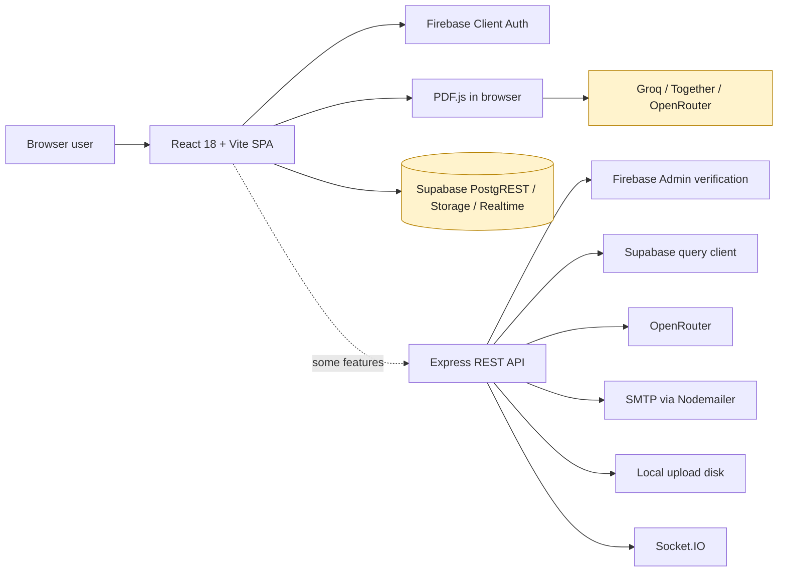
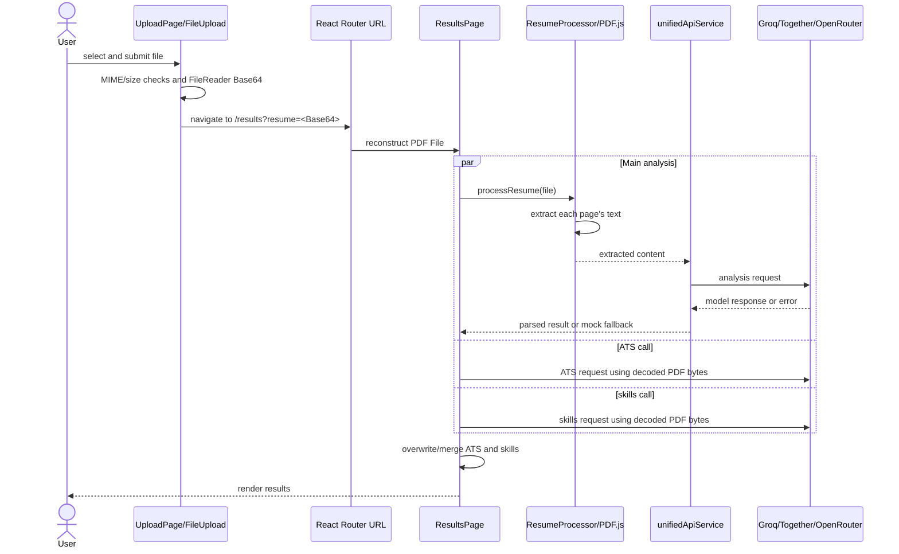
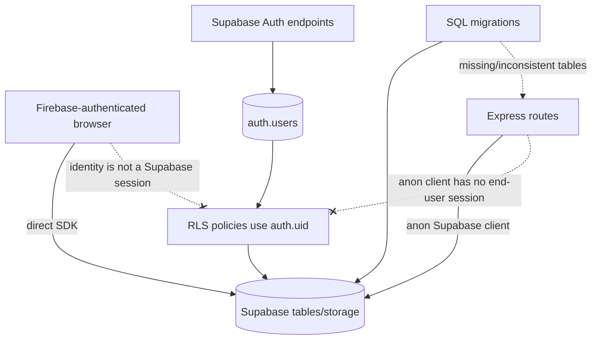
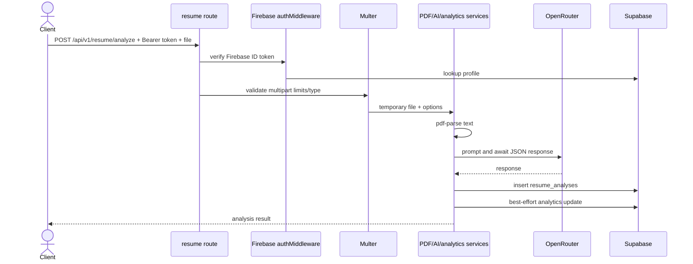
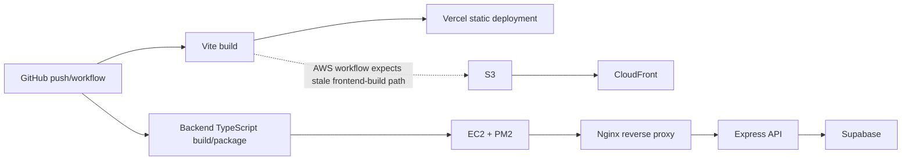
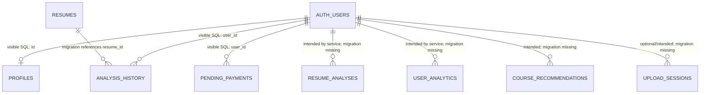
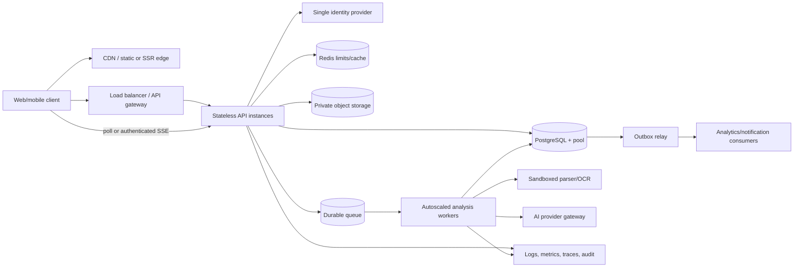
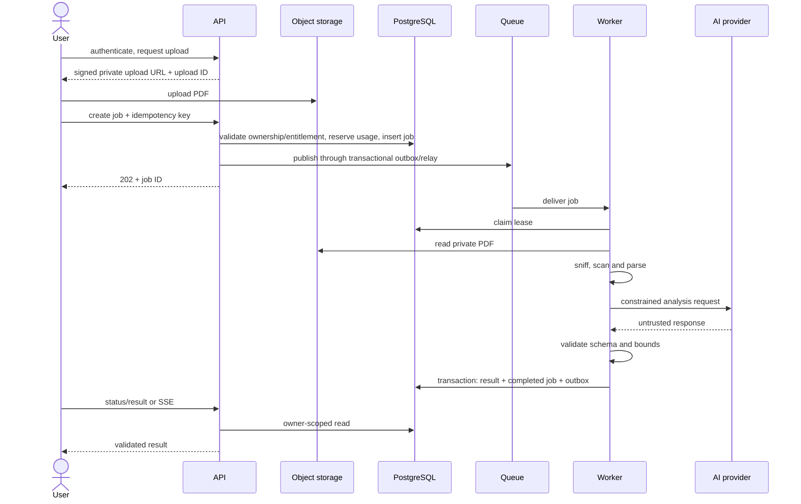

# ResumeAI — Project Interview Preparation

> Repository-based review prepared on 27 July 2026. This document treats executable code as the source of truth. It does not include any credential values.

## How to use this document

The repository contains a broad product prototype, several generations of the same feature, and documentation that sometimes describes the intended product rather than the active runtime. Use these labels throughout:

- **Implemented** — code is reachable from the active application or a mounted backend route.
- **Partial** — meaningful code exists, but it is mocked, inconsistent, missing persistence/security, or not connected end to end.
- **Legacy/unwired** — code exists but the active UI or server flow does not use it.
- **Proposed** — an interview-safe improvement, not a claim about the current repository.
- **Unverified operationally** — code/configuration exists, but deployment, credentials, migrations, or external service state cannot be confirmed from source.

The most defensible interview position is: **this is an ambitious full-stack prototype with a strong UI and several working local flows, but its identity, payment, database, and AI boundaries need consolidation before production.** Do not claim production traffic, production reliability, complete premium enforcement, complete Microsoft Word analysis, comprehensive automated tests, Docker support, or a deployed microservice architecture.

---

# 1. Project Introduction

## Project identity

**Name:** ResumeAI / AI-Powered Resume Analyzer SaaS  
**One line:** A React and TypeScript application that extracts resume content, requests AI-assisted feedback, presents ATS and skill insights, and includes a local resume builder and premium-product prototype.

### The real-world problem

Candidates often do not know whether an applicant-tracking system can parse their resume, whether their evidence is specific enough, or which skills are missing for a target role. ResumeAI brings those checks into one workflow. The current active analysis flow parses PDFs in the browser and calls configured AI providers, while the UI also offers a resume builder, course suggestions, analytics screens, authentication, and payment flows at different levels of completion.

### Target users and use cases

- Students and job seekers who want rapid resume feedback.
- Candidates tailoring a resume for a role or checking ATS readability.
- Users creating a resume from structured sections and printable templates.
- Premium users, in the intended product model, who want analytics, comparisons, and higher limits.
- Administrators who manually review submitted UPI payment proofs. This admin workflow is **partial and insufficiently protected**.

### Why it is useful and technically interesting

The useful core is the combination of browser-side PDF extraction, AI-provider orchestration, a results experience, and structured resume creation. Technically, the repository is interesting because it exposes real engineering trade-offs: client versus server AI calls, Firebase versus Supabase identity, row-level security, untrusted model output, file privacy, premium entitlement enforcement, asynchronous work, and migration consistency.

### My contribution — defensible wording

The repository does not contain authorship history sufficient to prove which person wrote each line. A truthful first-person answer is:

> I built and integrated the application represented by this repository: the React user experience, PDF analysis pipeline, AI-provider adapters, resume builder, Firebase authentication, Supabase-backed product experiments, and an Express API with analysis, analytics, upload, payment, profile, course, email, and health routes. During review I also identified that some modules are legacy or incomplete, especially the mixed authentication model, client-side entitlement logic, database migrations, and deployment automation. I would describe those honestly instead of presenting every screen as production-ready.

## Interview introductions

### 30-second version

> ResumeAI is a full-stack TypeScript prototype for analyzing and building resumes. The active React flow extracts text from a PDF with PDF.js, sends it to configured AI providers, and presents ATS, skill-gap, and recommendation views. The repository also contains Firebase authentication, Supabase data integrations, a resume builder, and an Express API. The biggest engineering lesson was that identity, payments, and AI access must be enforced behind one trusted server boundary; several current flows are prototypes that I would consolidate before production.

### 60-second version

> I built ResumeAI to help job seekers understand how an ATS and a recruiter may read their resume. It uses React, TypeScript, Vite, Tailwind, and PDF.js on the frontend. A PDF is parsed in the browser and the extracted content is analyzed through provider adapters for Groq, Together AI, or OpenRouter, with the results shown as ATS and skill insights. There is also a Zustand-based resume builder with printable templates. The repository includes an Express and Supabase backend for analysis history, analytics, uploads, payments, courses, email, and health checks, plus Firebase authentication. The current code is a prototype rather than a finished production system: the active UI bypasses much of the Express analysis API, some failures fall back to mock results, and Firebase identity is not correctly bridged to Supabase RLS. My redesign would move AI and entitlement decisions server-side, use one identity model, complete migrations, and add queues, idempotency, observability, and automated tests.

### Two-minute version

> ResumeAI started from a practical placement problem: a candidate can write a technically correct resume but still fail because the PDF is difficult to parse, achievements are vague, or relevant skills are missing. The product combines analysis and creation. In the active upload flow, an authenticated React user selects a file, the browser serializes it for navigation, PDF.js extracts page text, and provider-specific services request structured AI feedback. The results page combines the main analysis with ATS and skills calls and renders recommendations, charts, and course suggestions. Separately, the resume builder stores structured sections in a Zustand store and renders several printable templates.
>
> The frontend uses React Router, contexts for authentication, subscriptions, accessibility, themes, notifications and toasts, and lazy-loaded pages. Firebase Client Auth handles email/password and social sign-in. Supabase is called directly for some profile, analytics, payment, storage, and realtime operations. The Express backend has middleware, services, Firebase Admin token verification, Socket.IO, upload handling, OpenRouter-based analysis, and REST routes for the broader product.
>
> The important architectural finding is that these pieces are not yet one coherent trust boundary. The active analysis page calls AI providers directly using build-time `VITE_*` configuration, which makes those values public and sends resume data from the browser. Firebase users are also used against Supabase tables whose RLS and UUID foreign keys expect Supabase Auth identities. Premium state can be changed through client storage, and manual payment submission grants local premium before an administrator verifies it. The backend has a second Supabase/JWT login flow whose tokens are incompatible with its Firebase-protected routes.
>
> I would present the project as a substantial prototype and explain the hardening plan: one authentication authority, a server-side analysis gateway, private object storage, validated model output, durable jobs for large analyses, authoritative server entitlements, idempotent payments, complete migrations, and integration tests. That ability to distinguish a demo that works from a system that is safe to operate is one of the strongest interview discussions in the project.

---

# 2. Project Features

## Feature status map

| Feature | Status | What the repository actually does | Main files |
|---|---|---|---|
| Email/password and social authentication | Implemented, with integration defects | Firebase Client Auth supports email/password and Google/GitHub flows. Profile synchronization to Supabase is incompatible with the visible schema/RLS. | `src/context/AuthContext.tsx`, `src/utils/firebaseClient.ts` |
| PDF resume analysis | Implemented prototype | The active UI extracts PDF text in the browser and calls AI provider services. It can silently return mock analysis on failure. | `src/pages/UploadPage.tsx`, `src/pages/ResultsPage.tsx`, `src/utils/pdf/pdfProcessor.ts`, `src/services/api/unifiedApiService.ts` |
| ATS and skill analysis | Partial | Separate Groq calls exist, but `ResultsPage` passes decoded PDF bytes rather than extracted text to two of them and overwrites fields from the main result. | `src/pages/ResultsPage.tsx`, `src/utils/groqApi.ts` |
| Resume builder and templates | Implemented locally | Users edit structured resume data, switch templates and print/export through the browser. Persistence is client-side. The “AI check” is a heuristic timer, not an AI call. | `src/pages/MasterCVPage.tsx`, `src/components/ResumeBuilder.tsx`, resume-builder store/templates |
| Analysis history through Express | Implemented as API code; unwired from active UI | Authenticated backend routes analyze, store and retrieve resume analysis records. Required tables/migrations and production reachability are incomplete. | `backend/src/routes/resume.ts`, `backend/src/services/aiAnalysisService.ts`, `backend/src/services/pdfProcessingService.ts` |
| Course recommendations | Partial | Frontend and backend contain static/heuristic recommendation logic. Some generated links or recommendations are illustrative rather than verified catalog data. | `backend/src/routes/courses.ts`, frontend course components/services |
| Analytics dashboard | Partial/mock-capable | Direct Supabase queries and realtime subscription exist, but errors can be replaced with generated mock data; backend analytics is separate and not the active UI path. | `src/pages/AnalyticsPage.tsx`, `src/api/analytics.ts`, `backend/src/routes/analytics.ts` |
| UPI premium purchase | Partial and insecure | A screenshot and transaction ID are inserted into Supabase. The client invokes its success callback before admin verification and stores entitlement locally. | `src/components/premium/PaymentModal.tsx`, `src/components/premium/UpiPayment.tsx`, `src/context/SubscriptionContext.tsx` |
| Manual payment administration | Partial | A signed-in user can reach the page; RLS intends an admin check, but Firebase is not bridged to Supabase. Approval changes a record but does not activate the subscription in this page. | `src/pages/PaymentVerificationPage.tsx`, `sql/create_pending_payments_table.sql` |
| Backend UPI API | Partial and insecure | Its route creates orders and treats any non-empty transaction identifier as enough to activate a subscription. | `backend/src/routes/payment.ts` |
| Razorpay integration | Legacy/unwired | Service code, SQL, Edge Functions, and dashboard code exist, but the active payment modal uses manual UPI. Deployment and live status are unverified. | `src/utils/razorpayService.ts`, `supabase/functions/*`, `sql/create_razorpay_tables.sql` |
| Session-based single/batch uploads | Backend code implemented; not safely exposed | The Express upload router stores whole files on local disk and session metadata in Supabase. Status, deletion, and cleanup operations lack ownership enforcement. | `backend/src/routes/upload.ts` |
| Real-time progress | Partial/mock | The frontend hook uses timers/mock data. The backend has unauthenticated Socket.IO room joining, but no active frontend Socket.IO client integration. | `src/hooks/useRealtimeAnalysis.ts`, `backend/src/server.ts` |
| Profile management | Partial | Active profile UI reads Supabase-style properties from a Firebase user and save/delete actions are mostly UI feedback. Separate backend endpoints exist, including no-op destructive/password actions. | `src/pages/ProfilePageImproved.tsx`, `backend/src/routes/profile.ts` |
| Contact email | Implemented conditionally | The contact form calls the Express email route; successful delivery depends on SMTP configuration. HTML content is built without escaping user input. | contact page/component, `backend/src/routes/email.ts`, `backend/src/utils/emailService.ts` |
| SEO/content pages | Implemented | Helmet metadata, structured data, landing pages, blog routes, sitemap and robots files exist. Some analytics IDs and dashboard content are placeholders. | `src/App.tsx`, SEO/content components, `public/sitemap.xml`, `public/robots.txt` |
| Job matching | Legacy/unwired | A local overlap algorithm and hard-coded jobs exist, but the components are not part of the active route flow; one parser dependency is absent. | job-matching components/hooks, `src/services/jobs/resumeParseService.ts` |
| Automated testing | Minimal/partial | One manual subscription validation script exists; backend Jest reports no tests. No runnable root test script or meaningful suite is present. | `src/__tests__/subscriptionValidation.test.ts`, backend Jest config/package |

## Important feature walkthroughs

### A. Active PDF analysis

**Purpose:** turn a candidate's PDF into structured resume feedback.  
**Why needed:** raw resumes need parsing before a model can reason about sections, skills, and ATS signals.  
**Implementation:** `UploadPage` and `FileUpload` collect the file. `ResultsPage` reconstructs it, `ResumeProcessor` uses PDF.js to read pages, and `unifiedApiService` selects the configured AI provider.  
**Execution:** select PDF → authenticate → convert to Base64 → navigate to `/results` → rebuild `File` → extract text → run three analysis calls → merge results → render panels.  
**Handled edges:** UI size/type checks, missing file state, provider failures, loading UI.  
**Weak edges:** Word files are accepted by parts of the UI/backend but the active parser is PDF-only; Base64 is put in the URL; abort is not wired; model responses are weakly validated; fallback mock data is not clearly labeled.

Interview question: **Why parse in the browser?**  
Answer: It reduced initial backend dependency and made the prototype responsive, but it exposes data-flow and key-management problems. In production I would upload privately, parse in a worker, keep provider credentials server-side, and return a job identifier.

### B. Resume builder

**Purpose:** create and format a resume from structured data.  
**Implementation:** a large builder component edits sections through reusable controls, keeps data in a Zustand store/local storage, selects among templates, and uses browser printing for output.  
**Flow:** open `/master` → enter builder → edit store-backed sections → select template → preview → print/export.  
**Handled edges:** optional sections, repeatable entries, theme/template choices, local persistence.  
**Weak edges:** no authoritative cloud versioning, collaboration, server validation, or automated layout regression tests; “AI” checks are deterministic heuristics.

Interview question: **Why structured data instead of editing HTML?**  
Answer: Structured data separates content from presentation, lets multiple templates share the same model, and makes validation/export easier.

### C. Authentication

**Purpose:** identify users and gate protected pages.  
**Implementation:** Firebase Client Auth is the active frontend identity provider. `AuthContext` observes auth state and `ProtectedRoute` redirects signed-out users. The Express protected routes verify Firebase ID tokens with Firebase Admin.  
**Flow:** login/signup → Firebase returns user/token → context updates → protected route renders → backend request should send Bearer ID token → middleware verifies token.  
**Weak edge:** a second backend Supabase Auth/custom JWT flow issues tokens that Firebase middleware cannot accept. Direct Supabase table calls also do not inherit the Firebase identity.

Interview question: **What is the most important auth redesign?**  
Answer: Choose one authority. Either use Supabase Auth end to end or exchange/verify Firebase tokens at the backend and have the backend make service-role database calls with explicit authorization. Do not pretend Firebase identity automatically satisfies Supabase `auth.uid()`.

### D. Subscription and payment

**Purpose:** collect a manual UPI payment and unlock premium features.  
**Implementation:** `UpiPayment` constructs a UPI URI, uploads proof to Supabase Storage, and inserts `pending_payments`; `SubscriptionContext` persists tier/features/usage in local storage.  
**Flow currently:** choose plan → pay externally → submit transaction/proof → pending row → success screen → click “Got It” → client callback grants local subscription.  
**Critical edge:** admin verification is not required for that local grant, storage is configured public, the client controls plan data, and `user.id` is used even though Firebase exposes `uid`. This must not be described as production payment verification.

Interview question: **Where should entitlement be decided?**  
Answer: On the server, from a verified, idempotent payment state transition. The client should only render entitlements returned by an authenticated API.

### E. Analytics

**Purpose:** show score history, trends, skill data, and recommendations.  
**Implementation:** the active frontend calls Supabase through `src/api/analytics.ts` and can subscribe to realtime changes; the Express backend separately offers dashboard/trend/benchmark/export routes.  
**Edge:** generated fallback data makes the UI demoable but can misrepresent real history. The API also performs redundant queries and uses incomplete schema.

Interview question: **How would you distinguish mock from real analytics?**  
Answer: Make data provenance explicit in the type and UI, disable mock fallback in production, capture telemetry on data failures, and test against seeded integration data.

### F. Upload sessions

**Purpose:** support session-based single and batch server uploads.  
**Implementation:** Multer and the upload route write whole local files and store session metadata; routes support create, single upload, batch upload, status, delete, and cleanup.  
**Edge:** operations after session creation do not consistently authenticate or verify ownership. Local disk is also incompatible with multi-instance/serverless deployment.

Interview question: **How would you scale uploads?**  
Answer: issue short-lived signed object-storage uploads, record ownership and state in the database, validate content, process asynchronously, and make every status/delete operation owner-scoped.

### Feature-specific edge cases worth remembering

- Empty/corrupt/encrypted PDF, image-only PDF, unusually long resume, and unsupported Word input.
- AI returns prose instead of JSON, invalid score ranges, unsafe links, or prompt-injected instructions.
- User refreshes `/results` after URL state disappears or exceeds browser URL limits.
- Duplicate UPI transaction ID, wrong amount, reused screenshot, concurrent approvals, or approval after cancellation.
- Auth token expiry during analysis; Firebase account exists but profile upsert fails.
- Database insert succeeds but analytics update fails.
- The same file is submitted twice, a batch partially fails, a session expires, cleanup races with upload, or another server instance cannot see the local file.
- External AI/SMTP/Supabase is slow, rate-limited, or unavailable.

---

# 3. Technology Stack

| Technology | Actual use | Why/benefit | Limitation in this repository | Alternative and when better |
|---|---|---|---|---|
| TypeScript | Frontend and backend | Shared language, editor support, safer models | Current root type-check fails because JSX exists in `chartOptimization.ts`; several Firebase/Supabase type mismatches remain | Strict schemas plus generated API types for stronger contracts |
| React 18 | SPA UI and component model | Strong ecosystem, reusable pages/components | Several components exceed 2,000 lines and hold too many responsibilities | Next.js/Remix if SSR, server actions, or stronger routing/data conventions are required |
| React Router 7 | Client routing and protected routes | Lazy route composition and SPA navigation | Authorization remains client-visible only for frontend pages | Framework routing with server authorization for sensitive pages |
| Vite 6 | Frontend development/build | Fast development and configurable chunks | `VITE_*` values are public by design; large vendor bundle | Next.js build when SSR is needed; keep Vite but move secrets server-side |
| Tailwind CSS / Radix UI | Styling and accessible primitives | Fast UI composition and consistency | Large class-heavy components; accessibility still needs audits | CSS Modules/design system for tighter ownership |
| Framer Motion / Lucide / Recharts | Motion, icons, charts | Rich presentation | Adds bundle weight; charts may be fed mock data | CSS transitions and lighter charting when bundle size dominates |
| Zustand | Resume-builder state | Small, direct structured state store | Local-only persistence and no version/conflict model | Server-backed state or TanStack Query for synchronized documents |
| React Context | Auth, subscription, theme, accessibility, toast, notification | Simple global state without another framework | Broad rerenders and client-trusted subscription state | Split contexts, selector-based store, authoritative server query |
| TanStack Query | Present in a legacy analysis hook/provider | Cache/retry model for server state | `ReactQueryProvider` is not mounted in the active app, so the intended hook is not active | Mount centrally and standardize all server state through it |
| PDF.js | Active browser PDF extraction | Avoids initial server parsing and supports page text | Large worker/bundle, sequential extraction, no OCR, exposes sensitive text in browser flow | Server parser/OCR worker for privacy and heavy files |
| Express 4 | REST backend | Familiar middleware/service ecosystem | Route handlers contain controller logic; API is not the active analysis path | Fastify for schema/performance, or framework server routes for a smaller product |
| Socket.IO | Backend progress room code | Convenient bidirectional events | No active frontend client and room join is unauthenticated | Authenticated SSE for one-way progress; secured Socket.IO for richer events |
| Supabase/PostgreSQL | Tables, RLS, storage, realtime, some auth and direct frontend queries | Managed SQL, storage and realtime | Migrations are incomplete/inconsistent; Firebase IDs do not match Supabase Auth UUID/RLS | Plain PostgreSQL behind backend; or Supabase Auth end to end |
| Supabase query builder | Data access | Parameterized queries and concise API | No repository abstraction; backend uses anon client for table work | Service-role backend repository with explicit authorization, or Prisma/Drizzle for migrations/types |
| Firebase Auth/Admin | Active frontend identity and backend token verification | Mature social/email identity and token validation | Coexists incompatibly with Supabase Auth/JWT and RLS | Use only Firebase plus backend DB authorization, or only Supabase Auth |
| JSON Web Tokens | Custom backend auth/refresh code | Stateless bearer tokens | Second token type conflicts with Firebase middleware; refresh semantics are unsafe | One issuer with access/refresh token rotation, or secure server sessions |
| Axios / fetch | AI and API calls | Simple HTTP clients | Cancellation/timeouts/retry behavior is inconsistent | One typed client with deadlines, retry policy and correlation IDs |
| Groq, Together AI, OpenRouter | Resume analysis/provider fallbacks | Access to hosted language models | Active UI exposes browser-configured keys and sends PII directly; model IDs/runtime availability are unverified | Server-side provider gateway with policy, budgets, validation and redaction |
| Multer / `pdf-parse` | Backend file reception and PDF extraction | Familiar multipart and text parsing | MIME-only checks, local disk, Word accepted but parsed as PDF | Signed object upload, content sniffing, malware scan, isolated parser worker |
| Nodemailer | SMTP contact/welcome/test email | Provider-neutral SMTP support | Contact HTML is not escaped; delivery is synchronous and configuration-sensitive | Queued transactional email provider with templates |
| Helmet, CORS, rate limiting, compression | Express middleware | Sensible HTTP baseline | Rate limit is in-memory; allowlists/config do not repair route authorization | Redis-backed limits, API gateway/WAF, endpoint-specific policies |
| Winston | Backend logs | Structured levels, files and console | No request correlation or remote sink/APM; local files are fragile on ephemeral hosts | OpenTelemetry plus centralized logs/metrics/traces |
| Jest configuration | Backend test tooling | Standard JS/TS test ecosystem | No backend tests were discovered; root lacks a runnable suite | Vitest for Vite frontend, Jest/Supertest backend, Playwright E2E |
| Vercel config | Frontend deployment | Fits Vite static output (`dist`) | Runtime status unverified | CDN/static host with verified env and headers |
| PM2, Nginx, EC2/CloudFront scripts | Intended backend/AWS deployment | Process management and reverse proxy | Workflow paths, artifacts and required env variables do not align with current repo | Container/image-based or corrected artifact deployment with health-based rollout |
| GitHub Actions | Deployment workflows | Automatable releases | Deploy-only workflows omit quality gates and contain stale paths/output assumptions | Build/test/security/migration gates plus immutable artifact promotion |
| Docker, Redis, queues, schedulers | Not implemented | Some dependencies/config hints exist | No Dockerfile/Compose application, cache implementation, queue, or scheduler | Add only when operational needs justify them |

**ORM answer:** there is no ORM. Supabase's query builder is used directly.  
**Architecture answer:** REST APIs exist, but the active frontend also calls Firebase, Supabase, and AI providers directly; it is not a clean backend-for-frontend architecture.  
**Containerization answer:** not implemented. An empty Compose-related Nginx file is not a Docker deployment.

---

# 4. System Architecture

## High-level architecture — current repository



The warning-colored direct browser boundaries are the main architectural concern. Browser code cannot protect provider secrets, and Firebase login does not automatically produce a Supabase Auth session for RLS.

## Frontend architecture

`src/main.tsx` mounts `App`. `App.tsx` composes global providers and lazy React Router routes. Feature pages call contexts, hooks, and services. There are two state styles:

- Client/UI state through React state, Context and Zustand.
- Remote state through direct SDK calls and ad hoc hooks. TanStack Query exists but its provider is not mounted in the active tree.

The route boundary improves initial loading, but large feature modules and duplicate service generations make ownership unclear.

## Backend architecture

The backend is a modular Express monolith:

```text
server/bootstrap
  -> global security, parsing, rate, compression and logging middleware
  -> versioned route modules
  -> route-level validation/controller logic
  -> service modules
  -> Supabase / AI / SMTP / local filesystem
```

It has service layering but no dedicated controller or repository layer. This is appropriate for a prototype, though route files have grown into business logic. Socket.IO is attached to the HTTP server.

## Active analysis request-response flow



This diagram deliberately shows the two incorrect binary-input calls and the absence of the Express API from the active path.

## Authentication flow

```mermaid
sequenceDiagram
    actor User
    participant UI as Login/Signup UI
    participant AC as AuthContext
    participant FC as Firebase Client Auth
    participant S as Supabase tables
    participant API as Express protected route
    participant FA as Firebase Admin

    User->>UI: credentials or social login
    UI->>FC: sign in / popup / redirect
    FC-->>AC: Firebase User + ID token
    AC->>S: direct profile upsert with Firebase UID
    Note over AC,S: Schema/RLS expects Supabase auth UUID; this is incompatible
    AC-->>UI: user state
    UI->>API: Bearer Firebase ID token, when backend is used
    API->>FA: verifyIdToken(token)
    FA-->>API: decoded identity
    API->>S: query profile using anon Supabase client
    Note over API,S: No Supabase user session/service-role data client
```

There is also a separate `/auth/register` and `/auth/login` Supabase Auth/custom-JWT flow. Its token is not accepted by the Firebase middleware protecting most backend routes, so it should be treated as an incompatible legacy path.

## Database interaction



## Intended backend analysis workflow



The last two writes are not transactional, and the migration for `resume_analyses` is not present.

## Error and logging flow

- Frontend pages catch many errors, log to the console, show a toast/error panel, or substitute mock data.
- React error boundaries prevent some component crashes but do not report to a monitoring service.
- Express route handlers use a mix of local `try/catch` and `next(error)`.
- Global middleware formats errors and hides stacks only in production.
- Winston writes console output in development and local rotating-by-count log files; no centralized sink, trace ID, metric, or alert is configured.
- Provider retry behavior is inconsistent: some frontend Groq/Together utilities retry, while backend OpenRouter calls have no consistent deadline/retry/circuit breaker.

## Deployment architecture — identifiable intent



**Unverified operationally:** Vercel, S3/CloudFront and EC2 assets exist, but the Actions workflows contain stale `project/` and output-path assumptions. The backend production static-serving branch also uses `__dirname` in an ES module without defining it. A successful live deployment cannot be inferred.

---

# 5. Folder Structure

```text
.
├─ src/                     React application
│  ├─ pages/                Route-level screens
│  ├─ components/           Shared and feature UI
│  ├─ context/              Auth, subscription, UI/global state
│  ├─ hooks/                Feature and state hooks
│  ├─ services/             PDF, AI provider, payment and domain services
│  ├─ api/                  Direct remote-data helpers
│  ├─ utils/                Firebase/Supabase clients and utilities
│  ├─ types/                Shared frontend types
│  └─ __tests__/            One manual subscription validation script
├─ backend/
│  ├─ src/
│  │  ├─ routes/            Versioned Express endpoint modules
│  │  ├─ middleware/        Auth, error, logging and security middleware
│  │  ├─ services/          Analysis, upload, analytics, email and payment logic
│  │  ├─ config/            Environment and Supabase configuration
│  │  └─ utils/             Logger and helpers
│  └─ test/data/            PDF fixtures, not an automated suite
├─ sql/                     Manually applied Supabase SQL scripts
├─ supabase/
│  ├─ migrations/           A limited analysis-history migration
│  └─ functions/            Legacy Razorpay Edge Functions
├─ deploy/aws/              Nginx, PM2 and AWS deployment assets
├─ .github/workflows/       Frontend/backend deployment workflows
├─ public/                  Static assets, robots and sitemap
├─ sample-resumes/          Local sample inputs
├─ package.json             Frontend scripts/dependencies
├─ vite.config.ts           Vite build/chunk configuration
├─ vercel.json              Static deployment configuration
└─ backend/package.json     Backend scripts/dependencies
```

### How the major areas connect

- `src/pages` should be the composition layer. Some pages follow that model, while `ResultsPage` and builder modules also contain substantial domain/UI logic.
- `src/components` contains generic UI primitives and feature folders. Multiple generations of analysis/payment/profile components remain, which makes active ownership harder to see.
- `src/context` supplies global state. `AuthContext` wraps Firebase and attempts profile synchronization; `SubscriptionContext` is a client-side entitlement engine.
- `src/services` and `src/utils` overlap. AI calls exist in both, which contributes to the three-call analysis flow.
- `backend/src/routes` acts as both controller and validation layer. It calls `backend/src/services`, which calls external systems and Supabase directly.
- `sql` and `supabase/migrations` are not one ordered migration history. They describe only part of the tables referenced by services.
- `.github/workflows`, `deploy/aws`, `vercel.json`, `Procfile`, and PM2 config describe multiple deployment experiments rather than one proven release path.

This layout is reasonable for an evolving prototype, but the next cleanup should establish one active implementation per capability, a versioned migration chain, shared request/response schemas, and a clear frontend → backend → data boundary.

---

# 6. End-to-End Application Flow

## Application startup and navigation

1. Vite loads `src/main.tsx`.
2. `App.tsx` mounts error, theme, toast, notification, authentication, subscription and accessibility providers.
3. React Router lazily loads the requested page.
4. `AuthContext` subscribes to Firebase auth changes and attempts a direct Supabase profile upsert.
5. `ProtectedRoute` shows protected pages only when the client context has a user.
6. `SubscriptionContext` reconstructs plan data from local storage and the current email.

`ReactQueryProvider` exists but is not mounted, so do not say React Query governs the active data flow.

## Workflow 1: Analyze a resume from the active UI

```text
User
→ UploadPage / FileUpload
→ Firebase user check
→ FileReader Base64 conversion
→ React Router query parameter
→ ResultsPage
→ ResumeProcessor.processResume
→ PDF.js page extraction
→ unifiedApiService / provider services
→ Groq, Together AI or OpenRouter directly from browser
→ parsed or mock result
→ ResultsPage merge and render
```

There is no internal Express route, middleware, controller, repository, or database in this active workflow. That absence is important. `ResultsPage` also starts separate ATS and skill requests with raw decoded PDF bytes, then overwrites fields in the main result.

## Workflow 2: Analyze through the Express API

```text
Client
→ POST /api/v1/resume/analyze
→ global rate/security middleware
→ Firebase authMiddleware
→ Multer route handling
→ PDF processing service
→ pdf-parse
→ AI analysis service / OpenRouter
→ analytics service inserts resume_analyses
→ best-effort analytics update
→ JSON response
```

This is coded and mounted, but is not called by the active upload/results pages. A successful end-to-end run also depends on tables that are not created by the visible migrations.

## Workflow 3: Sign in

```text
Login/Signup page or modal
→ AuthContext method
→ Firebase Client Auth
→ onAuthStateChanged
→ direct profiles upsert through Supabase client
→ React context update
→ redirect/render protected route
```

For a backend call, the client must separately attach the Firebase ID token. The backend `/auth/login` custom JWT flow is not the same flow and is incompatible with the main Firebase middleware.

## Workflow 4: Manual UPI submission

```text
Pricing / SubscriptionContext
→ PaymentModal
→ UpiPayment
→ external UPI application
→ screenshot upload to Supabase Storage
→ insert pending_payments
→ success screen
→ onPaymentSuccess
→ localStorage subscription_data
→ premium UI unlocked locally
```

The administrator page can mark the pending row verified/rejected, but its visible approval action does not update the subscription record. Therefore the current user entitlement is not a trustworthy result of payment verification.

## Workflow 5: Resume builder

```text
MasterCVPage
→ ResumeBuilder
→ section editors
→ Zustand resume store/local persistence
→ selected template
→ preview
→ react-to-print/browser PDF
```

The builder is mostly self-contained. It does not require the Express API and has no collaborative/cloud document workflow.

## Workflow 6: Analytics page

```text
Protected + premium route/UI
→ AnalyticsPage
→ frontend analytics API helper
→ Supabase tables and realtime subscription
→ real rows OR generated fallback data
→ charts/cards
```

The Express analytics endpoints form a different path. Both require schema and identity work before reliable production use.

---

# 7. Database Design

## What is actually present

The intended database is PostgreSQL delivered through Supabase. Data access uses the Supabase JavaScript query builder; there is no ORM, repository layer, or complete generated database type. SQL lives in both `sql/` and `supabase/migrations/`, but those files are not a single ordered, complete migration history.

### Schema summary

| Entity/table | Visible schema source | Important keys/constraints | Runtime consumers | Status |
|---|---|---|---|---|
| `profiles` | `sql/create_profiles_table.sql`, also legacy Razorpay SQL | `id UUID` primary/foreign key to `auth.users(id)`; email/name; premium dates; RLS | Auth context, auth middleware, profile, payment | Defined, but incompatible with Firebase string UIDs and code-selected columns |
| `pending_payments` | `sql/create_pending_payments_table.sql` | UUID PK, UUID `user_id` FK, unique `transaction_id`, amount/plan/status checks, timestamps, RLS | Manual UPI frontend/admin | Defined, but storage path and identity do not satisfy policies |
| `payment_orders` / `payments` | `sql/create_razorpay_tables.sql` and patch | Legacy provider IDs, user references, status fields, RLS | Backend payment/legacy Razorpay code | Inconsistent with current service columns/types |
| `analysis_history` | `supabase/migrations/20240320000000_create_analysis_history.sql` | UUID PK, user/resume references, score/result JSON, indexes, RLS | Limited/legacy history path | Migration references `resumes(id)`, whose creation is absent |
| `resume_usage` column | `sql/add_resume_usage_column.sql` | JSONB on profiles | Intended usage tracking | SQL exists; active count stays in local storage and increment is not called |
| `resume_analyses` | No visible creation migration | Service assumes ID, user, text, result, score and timestamps | Express resume service/routes | Missing schema |
| `user_analytics`, `analytics_trends` | No visible creation migration | Service assumes per-user counters, averages and trend rows | Express analytics service/routes | Missing schema |
| `course_recommendations` | No visible creation migration | Service/routes assume saved/completed/progress data | Express course routes | Missing schema |
| `upload_sessions` | No visible creation migration | Upload route stores JSON/session state | Upload routes | Missing schema |
| subscription-related tables | Partial/legacy definitions | Code assumes plan/status/expiry fields in several shapes | Payment/subscription APIs | Inconsistent |

### Relationships that can be defended

- Visible SQL intends a one-to-one relationship from `auth.users` to `profiles`.
- `pending_payments.user_id` intends many payment submissions per authenticated user, with a unique external transaction ID.
- `analysis_history` intends many analyses per user and a relationship to a `resumes` table.
- Backend services intend one-to-many relationships from user to analyses, trend records, saved courses and upload sessions, but the foreign keys cannot be verified because their migrations are absent.



`RESUMES` is shown because a visible migration references it, not because its creation was found.

## Keys, indexes, constraints and RLS

- Primary keys are mostly UUIDs in the visible Supabase SQL. Legacy payment SQL also uses serial/internal identifiers.
- `profiles.id` is already indexed by its primary key; the additional explicit index is redundant.
- `pending_payments.transaction_id` is unique and also indexed, providing duplicate-payment protection at that table boundary.
- Check constraints restrict payment status, currency/amount assumptions and plan types in the manual payment schema.
- RLS policies intend owner read/write using `auth.uid()` and administrator access using Supabase Auth metadata.
- Storage policy expects the first object-path segment to be the authenticated UID, while the UI writes `payment-proofs/{user.id}-{timestamp}`. The shapes do not match.
- Missing-table services cannot be evaluated for foreign keys, indexes or constraints.

## Validation, transactions and consistency

Database constraints provide some payment validation, but most request validation is manual and incomplete. There is no application transaction around:

- inserting an analysis and updating analytics;
- verifying a payment and activating a subscription;
- uploading an object and inserting its database record;
- deleting a user and associated data.

Consequences include orphaned objects, an analysis without analytics, or an entitlement and payment record disagreeing. Analytics uses read-modify-write logic, so concurrent updates can lose increments. The migration strategy is manual and fragmented; a clean environment is unlikely to build successfully because `analysis_history` references an absent `resumes` relation and many runtime tables have no migration.

## Important query patterns and performance concerns

- History endpoints paginate rows, but totals are sometimes derived from the current page rather than an exact count.
- Analytics dashboard generation repeats `getUserAnalytics`, creating avoidable queries.
- Trend selection accepts a dynamic metric and needs a strict allowlist.
- Exports can become unbounded and should be asynchronous for large histories.
- User/time/status compound indexes should follow measured query patterns; missing schemas prevent confirming them.
- JSONB is convenient for model results and usage state but makes constraints, indexing and analytics harder. Keep raw model output separate from normalized searchable fields.
- Full resume text is stored by the analysis service, creating privacy, retention and storage concerns.

## Database interview questions

**Why PostgreSQL?**  
The domain has relational identity, payment, analysis-history and entitlement data that benefit from transactions, constraints and indexes. JSONB still supports flexible model output.

**Why is Firebase UID versus UUID a real bug?**  
Firebase UIDs are opaque strings and are not rows in Supabase `auth.users`; the visible foreign key requires a Supabase UUID. A cast or similarly named field does not establish identity.

**What isolation is needed for payment activation?**  
A transaction should lock the payment/order row, verify a valid state transition, write entitlement and an audit record, and commit once. An idempotency/unique key must make retries safe.

**How would you migrate safely?**  
Adopt one ordered migration tool, make every environment apply the same chain, add backward-compatible columns first, backfill and verify, deploy readers/writers, then remove old fields later. Test the migration from an empty database and a production-like snapshot.

**Would you store the whole resume?**  
Only if product/legal requirements justify it. Prefer encrypted private object storage, a short retention period, deletion controls, and normalized/redacted analysis data; never keep it simply because it is convenient.

---

# 8. API Documentation

The default visible base is `/api/v1` (`API_VERSION` can change it). The table documents **mounted Express code**, not a claim that the active UI calls it or that all required tables exist. All `/resume`, `/analytics`, `/payment`, `/profile`, and `/courses` routes pass through the global Firebase `authMiddleware`. `/auth`, `/health`, `/upload`, and `/email` are mounted publicly, although two email routes add a different custom-JWT middleware.

## Health and authentication APIs

| Method and endpoint | Purpose and auth | Input | Success / important errors | Source |
|---|---|---|---|---|
| `GET /health` | Basic service/database health; public | — | status/version/timestamp; 503 on unhealthy dependency | `backend/src/routes/health.ts` |
| `GET /health/detailed` | Runtime, memory and service checks; public | — | detailed diagnostics; potentially overexposes internals | same |
| `GET /health/ready` | Readiness check; public | — | 200 ready or 503 | same |
| `GET /health/live` | Liveness; public | — | process alive | same |
| `GET /api/health` | Additional direct health route; public | — | simple health JSON | `backend/src/server.ts` |
| `POST /auth/register` | Supabase Auth registration plus profile and custom JWT; public | email, password, name | user/token; 400/409/500 | `backend/src/routes/auth.ts` |
| `POST /auth/login` | Supabase Auth login plus custom JWT; public | email, password | user/token; 400/401/500 | same |
| `POST /auth/logout` | Acknowledges logout; public | optional token context | success only; does not revoke a stateless token | same |
| `POST /auth/refresh` | Re-signs a verified custom token; public | refresh/access token field | new token; 400/401 | same |
| `POST /auth/forgot-password` | Requests Supabase reset email | email | generic/success or validation failure | same |
| `POST /auth/reset-password` | Intended password reset | token, password | response; implementation lacks a proper reset session | same |
| `POST /auth/verify-email` | Intended email verification | token/code | placeholder-style response | same |

The tokens issued by `/auth/login` and `/auth/register` are **not accepted** by the Firebase middleware used on protected groups. `register` also calculates a bcrypt hash that is not the password store used by Supabase Auth.

## Resume and analytics APIs

| Method and endpoint | Purpose / authorization | Input | Response / important errors | Source |
|---|---|---|---|---|
| `POST /resume/analyze` | Analyze one uploaded resume; Firebase auth | multipart `resume`, `jobRole`, `analysisType` | stored analysis; 400 file/input, 401, 413, provider/DB errors | `backend/src/routes/resume.ts` |
| `POST /resume/analyze-text` | Analyze supplied text; Firebase auth | resume text and options | analysis; validation/provider/DB errors | same |
| `GET /resume/history` | Current user's history | page/limit/filter query | paginated analyses | same |
| `GET /resume/:analysisId` | One owned analysis | path ID | record; 404/authorization-sensitive lookup | same |
| `DELETE /resume/:analysisId` | Delete owned analysis | path ID | success; 404/DB error | same |
| `POST /resume/compare` | Compare analyses; premium middleware | analysis IDs | comparison; 403/404/validation | same |
| `POST /resume/batch-analyze` | Analyze up to five files sequentially; premium | multipart `resumes` | array/partial errors | same |
| `GET /analytics/dashboard` | User summary and generated insights | optional range | dashboard; DB/provider error | `backend/src/routes/analytics.ts` |
| `GET /analytics/trends` | Time-series metric | period, metric | trend series; invalid query/DB error | same |
| `GET /analytics/benchmark` | Hard-coded/sample industry comparison | industry/role query | benchmark JSON | same |
| `GET /analytics/export` | Download JSON/CSV history | format/range | file; invalid format/DB error | same |
| `GET /analytics/admin/summary` | Global summaries; only normal auth currently | filters | aggregate data; authorization is missing | same |

## Upload APIs

| Method and endpoint | Purpose / auth | Input | Response / important errors | Source |
|---|---|---|---|---|
| `POST /upload/session` | Create upload session; optional Firebase auth | session metadata | session ID | `backend/src/routes/upload.ts` |
| `POST /upload/session/:sessionId` | Add one file; no route ownership check | multipart `file` | file/session state; size/type/session errors | same |
| `POST /upload/session/:sessionId/batch` | Add up to five files; no ownership check | multipart `files` | batch state/errors | same |
| `GET /upload/session/:sessionId` | Get status; public as mounted | path ID | session metadata; 404 | same |
| `DELETE /upload/file/:fileId` | Delete file; public as mounted | path ID | deleted/not found | same |
| `POST /upload/cleanup` | Remove expired uploads; public as mounted | optional cleanup parameters | cleanup count/error | same |

The latter five operations need authenticated owner/admin policies. The current identifiers behave like bearer secrets and are not sufficient authorization.

## Payment, profile, course and email APIs

| Method and endpoint | Purpose / authorization | Input | Response / important errors | Source |
|---|---|---|---|---|
| `GET /payment/plans` | List hard-coded plans; Firebase auth because group middleware applies | — | plan list | `backend/src/routes/payment.ts` |
| `POST /payment/create-upi-order` | Create manual UPI order; Firebase auth | plan selection | order/UPI data; validation/DB error | same |
| `POST /payment/verify` | Submit/“verify” transaction; Firebase auth | order/transaction data | pending/activated result and custom JWT; unsafe verification | same |
| `GET /payment/history` | Current user payment history | pagination query | records | same |
| `GET /payment/subscription` | Current subscription | — | entitlement state | same |
| `POST /payment/cancel` | Cancel subscription | optional reason | cancellation response; behavior conflicts with “active until end” wording | same |
| `POST /payment/webhook` | Intended provider webhook; incorrectly behind Firebase auth | provider body | event result; no visible signature validation | same |
| `GET /profile` | Fetch own profile | — | profile; 404/DB error | `backend/src/routes/profile.ts` |
| `PUT /profile` | Update own profile | profile fields | updated profile; weak validation | same |
| `POST /profile/avatar` | Save avatar URL | URL | updated field | same |
| `POST /profile/change-password` | Claims password change | old/new password | success-shaped no-op | same |
| `DELETE /profile` | Claims account deletion | confirmation | initiated-shaped no-op | same |
| `GET /profile/stats` | Profile/use statistics | — | stats; one member-since mapping is incorrect | same |
| `GET /profile/preferences` | Get preferences | — | defaults/current | same |
| `PUT /profile/preferences` | Echo/update preferences | preference object | success-shaped result; persistence incomplete | same |
| `GET /courses/recommendations` | Static/heuristic suggestions | skills, category, level query | courses | `backend/src/routes/courses.ts` |
| `GET /courses/categories` | List static categories | — | categories | same |
| `GET /courses/categories/:category` | Courses by category | category path | list/404 | same |
| `POST /courses/:courseId/save` | Save course | course path/body | record; DB errors | same |
| `DELETE /courses/:courseId/save` | Remove saved course | course path | success/404 | same |
| `GET /courses/saved` | List saved courses | — | list | same |
| `POST /courses/:courseId/complete` | Mark completed | course path | progress record | same |
| `GET /courses/progress` | Course progress | — | summary | same |
| `POST /email/contact` | Submit public contact email | name, email, subject, message | sent/failure; SMTP dependency | `backend/src/routes/email.ts` |
| `POST /email/test` | Send diagnostic mail; custom-JWT/admin middleware | test recipient/options | result; may expose operational errors | same |
| `GET /email/status` | SMTP status; custom-JWT/admin middleware | — | configuration status | same |

`POST /payment/create-order` appears inside a commented legacy block and is not an actual callable route. Do not put it in an API claim.

## Supabase Edge Functions — legacy/unverified

- Razorpay order creation: accepts client-controlled `amount` and `userId`, uses service privileges, and does not visibly establish the caller's identity.
- Razorpay verification: checks an HMAC but does not bind the submitted `userId` to an authenticated caller or make the update transactional.
- Razorpay webhook: checks an HMAC, but visible idempotency and schema alignment are incomplete.

These are not the active manual-UPI UI path.

## Three internal API flows to explain

### 1. `POST /resume/analyze`

1. Global Helmet/CORS/rate/body/logging middleware executes.
2. Firebase `authMiddleware` verifies the Bearer ID token and attaches the decoded user.
3. Multer accepts `resume` with configured size/MIME checks.
4. The route validates options and delegates to the analysis service.
5. `pdf-parse` extracts text. Although Word MIME types may be accepted, this parser does not implement DOC/DOCX extraction.
6. The service sends a prompt to OpenRouter and parses JSON. Network and malformed-output handling is inconsistent.
7. It inserts full resume text/result into `resume_analyses`.
8. It updates analytics separately and returns JSON.

Improvements: content sniffing and malware scanning, private object storage, schema validation, deadlines/retries, prompt-injection policy, transactional/outbox update, and async jobs for large work.

### 2. `POST /payment/verify`

1. Firebase middleware authenticates the request.
2. The route receives transaction/order data.
3. Current logic treats a non-empty UPI transaction ID as adequate proof.
4. It writes payment state and immediately updates profile/subscription fields.
5. It returns subscription information and a custom JWT that is incompatible with subsequent Firebase-protected endpoints.

Correct design: server/provider verification or admin approval → transaction locks payment → validates amount/currency/order/user/status → idempotently activates entitlement → audit event/outbox → client fetches authoritative entitlement.

### 3. `POST /upload/session/:sessionId`

1. The public route uses Multer to accept a file.
2. It finds the named upload session.
3. The route writes to local disk and updates session metadata directly through Supabase.
4. It returns file/session status.

The missing step is the most important: authenticate the caller and compare `session.user_id` to the token subject before reading or mutating anything. The storage layer should become object storage for multi-instance operation.

---

# 9. Authentication and Security

## Authentication mechanisms

### Active frontend

- Firebase Client Auth performs email/password, Google and GitHub authentication.
- `onAuthStateChanged` drives `AuthContext`.
- Firebase SDK manages its client persistence; the app can request an ID token for backend use.
- `ProtectedRoute` is a UX gate, not a security boundary.

### Protected Express API

- Global `authMiddleware` verifies Firebase ID tokens with Firebase Admin.
- It attempts to load a matching profile.
- `premiumMiddleware` checks a profile/entitlement on selected resume routes.

### Conflicting backend flow

- Public backend auth routes use Supabase Auth and issue an application JWT.
- Another middleware validates that custom JWT for admin email endpoints.
- Most protected routes validate Firebase tokens instead.
- Refresh logic does not issue/rotate a distinct refresh token; it can re-sign a verified token without robust token-type/revocation semantics.

The fix is not to support all three. Pick one issuer, one user key and one authorization model.

## Signup, login, token and password behavior

Firebase is the defensible active signup/login path. Firebase stores and validates passwords; the repository does not store Firebase password hashes. In the alternative backend registration route, Supabase Auth receives the password and an additional bcrypt hash is computed but unused. Token expiration follows the issuer, but the custom refresh implementation does not provide secure rotation or replay detection. Logout mostly clears client state; stateless server tokens are not centrally revoked.

Reset-password and verify-email endpoints are incomplete. The reset route does not establish the required recovery session before updating a password.

## Authorization and roles

- Client routes check only whether a user exists.
- `/admin/payments` is protected by ordinary login, not a frontend admin role.
- Supabase SQL attempts an administrator policy using `auth.users.raw_user_meta_data`, but Firebase users do not create a Supabase Auth session.
- `/analytics/admin/summary` has only global Firebase authentication and no admin middleware.
- Upload session mutation/status/deletion/cleanup lacks owner/admin authorization.
- Socket.IO lets a client join an arbitrary user-named room without token verification.

## Existing controls

| Control | What exists | Limit |
|---|---|---|
| Input validation | File size/MIME checks and scattered manual field checks | Joi/express-validator are installed but not systematically used; no shared schemas |
| CORS | Configured allowlist in Express | Must be correctly configured per environment; CORS is not authentication |
| HTTP headers | Helmet and a CSP | Does not fix direct secret exposure or authorization; CSP/provider-script compatibility needs testing |
| CSRF | No dedicated CSRF middleware | Bearer APIs are less exposed than cookie auth, but public mutation endpoints still need abuse controls |
| XSS | React escapes text interpolation by default | Contact email HTML interpolates unescaped input; unsafe URLs/model content need validation |
| SQL injection | Supabase query builder parameterizes normal filters | Dynamic column/metric choices still need strict allowlists; no raw SQL was required for normal requests |
| Rate limiting | In-process global Express rate limit | Not shared across instances; no per-user/provider budget |
| File security | MIME/size checks and Multer limits | No magic-byte verification, malware scan, PDF sandbox, owner checks, or consistent Word parser |
| Secrets | Environment variables and `.gitignore` entries | Environment files are already tracked, frontend `VITE_*` AI keys become public, and a migration document contains a historical-looking secret |
| Logging | Winston and optional Morgan | Some client/local logs contain user/login context; no redaction/correlation/central monitoring |

## Principal weaknesses and fixes

1. **Rotate and purge secrets.** Treat every tracked credential and any literal provider secret in documentation/history as compromised. Remove from Git history, use a secret manager, and add secret scanning.
2. **Move AI calls server-side.** `VITE_*` is substitution into public JavaScript, not secret storage. Proxy through an authenticated API with budgets and PII policy.
3. **Unify identity.** Use Supabase Auth end to end, or verify Firebase server-side and map Firebase UID to an internal user row that does not pretend to be `auth.users.id`.
4. **Make entitlements authoritative.** Payment status and plan limits must be read and enforced server-side. Local storage is only a cache.
5. **Secure every object operation.** Upload, analysis, payment and WebSocket resources require ownership checks based on verified identity.
6. **Make payment transitions idempotent and auditable.** Verify provider/admin evidence and amount; use transactions, unique keys and audit rows.
7. **Protect resume PII.** Remove Base64 from URLs, use private storage, minimize retention, encrypt, define deletion, and disclose provider processing.
8. **Validate model output.** Apply a schema, bounds, URL allowlist, safe rendering and prompt-injection-aware instructions. A model response is untrusted input.

## Security interview Q&A

**Is a protected React route secure?**  
No. Anyone can modify browser state or call an API directly. The server/database must repeat authentication and resource-level authorization.

**Why are `VITE_GROQ_API_KEY` and similar values exposed?**  
Vite replaces those values at build time in browser JavaScript. They are configuration, not secrets, once bundled.

**Does RLS solve the Firebase integration?**  
No. RLS is effective only when the Supabase request carries a recognized Supabase Auth identity/claims. A Firebase user object in React does not set `auth.uid()`.

**How would you stop IDOR in upload routes?**  
Authenticate every operation, store the verified subject as owner at session creation, query by both resource ID and owner ID, use an admin policy for cleanup, and return 404 for non-owned objects.

**How would you secure PDF processing?**  
Limit size/page count, inspect magic bytes, scan malware, parse in a sandboxed worker with CPU/memory/time limits, reject encrypted/unsupported files, and never use the original filename as a path.

**How do you defend against prompt injection in a resume?**  
Treat resume text as quoted untrusted data, isolate system instructions, request a strict schema, validate every field, constrain external actions/links, and never let model output authorize payment or execute tools.

**What about CSRF?**  
The main authenticated API design uses Authorization headers rather than ambient cookies, lowering classic CSRF risk. If secure cookies are adopted, add SameSite policy, origin checks and anti-CSRF tokens for unsafe methods.

---

# 10. Important Code Walkthroughs

## 1. `src/App.tsx`

**Responsibility:** provider composition, lazy routes and route protection.  
**Inputs/outputs:** browser location and context state → selected page tree.  
**Dependencies:** React Router, contexts, lazy page modules.  
**Pattern:** composition root, route-level code splitting.  
**Improve:** mount one server-state provider, derive route metadata, remove duplicate/unreachable pages, and add explicit admin guards.

Interviewer may ask: Why lazy-load pages? How is an error during dynamic import handled? Why is client route protection insufficient?

## 2. `src/context/AuthContext.tsx`

**Responsibility:** expose current Firebase user and login/signup/logout operations; attempt profile synchronization.  
**Flow:** subscribe to Firebase → update context → upsert `profiles`.  
**Pattern:** Provider plus Observer through the auth-state callback.  
**Improve:** remove fake Supabase-like session shape, use `uid` consistently, stop direct database writes, avoid listener re-registration, and centralize identity mapping.

## 3. `src/pages/UploadPage.tsx` and `src/components/ui/FileUpload.tsx`

**Responsibility:** gather a file and begin analysis.  
**Input/output:** user `File` → navigation state/URL.  
**Improve:** accept only formats actually parsed, never put the file in a query string, perform accessible validation, and upload through a private signed channel.

## 4. `src/pages/ResultsPage.tsx`

**Responsibility:** orchestrate analysis and render the complete result experience.  
**Dependencies:** PDF processor, unified provider service, Groq helpers, charts/premium/course UI.  
**Pattern:** currently a “god component” rather than a clean pattern.  
**Improve:** one typed analysis request, extracted-text reuse, reducer/state machine, cancellable operations, smaller view modules and explicit mock provenance.

## 5. `src/utils/pdf/pdfProcessor.ts`

**Responsibility:** singleton browser PDF processor that extracts page text and basic sections.  
**Input/output:** PDF `File` → structured parsed content/metadata.  
**Pattern:** Singleton and Adapter around PDF.js.  
**Improve:** dependency injection for testing, parallelism only when safe, page limits, OCR fallback, better section detection, and no dummy scoring fields.

## 6. `src/services/api/unifiedApiService.ts` and provider services

**Responsibility:** choose primary/fallback AI provider and normalize responses.  
**Pattern:** Facade with an informal Strategy/Adapter approach.  
**Improve:** move to backend, define one provider interface, validate JSON with Zod/Ajv, use supported model configuration, attach deadlines/telemetry, and distinguish degraded/mock results.

## 7. `src/context/SubscriptionContext.tsx`

**Responsibility:** plan features, usage counters, modal state and local subscription persistence.  
**Input/output:** Firebase user/email plus local storage → UI entitlement state.  
**Pattern:** Provider/state facade.  
**Improve:** fetch signed server entitlement, use `uid`, never grant on pending payment, invoke `incrementResumeCount` on authoritative analysis, and treat local state as a cache only.

## 8. `src/components/premium/UpiPayment.tsx`

**Responsibility:** create a UPI deep link, accept proof and insert pending payment.  
**Dependencies:** Auth, Supabase Storage/PostgREST, toast.  
**Improve:** server-created order, fixed server price, private owner-scoped upload, server validation, idempotency, accessible status, and no client entitlement callback.

## 9. `src/components/ResumeBuilder.tsx`

**Responsibility:** structured resume editing, templates, preview and print.  
**Pattern:** reusable component/template rendering with store-backed state.  
**Improve:** decompose the very large component, version persisted schema, validate dates/URLs, add undo/history and visual regression tests.

## 10. `backend/src/server.ts`

**Responsibility:** configure Express/HTTP/Socket.IO, middleware, routes, health endpoints and shutdown.  
**Pattern:** backend composition root and middleware pipeline.  
**Improve:** fix ESM `__dirname`, authenticate sockets, order/configure errors consistently, add request IDs, close all resources with a shutdown deadline, and separate app creation from listen for tests.

## 11. `backend/src/middleware/auth.ts` and `backend/src/middleware/authMiddleware.ts`

**Responsibility:** two different token-verification systems.  
**Problem:** one verifies Firebase; the other verifies custom JWT. Their coexistence creates incompatible authorization domains.  
**Improve:** retain one issuer/claims contract and write integration tests for every route group.

## 12. `backend/src/routes/resume.ts`, `aiAnalysisService.ts` and `pdfProcessingService.ts`

**Responsibility:** upload/text analysis, history, compare and batch processing; extraction, AI and persistence.  
**Pattern:** route/service layering and premium middleware.  
**Improve:** dedicated request schemas/controller, object storage, async jobs, reliable cleanup, provider resilience, schema-validated output, transactions/outbox and complete migrations.

## 13. `backend/src/routes/payment.ts`

**Responsibility:** plans, UPI orders, verification, history, subscription, cancellation and webhook.  
**Improve:** do not accept arbitrary transaction IDs as verification; put public provider webhooks outside user auth but behind signature validation; use raw request bodies where required; transact state changes; return the same Firebase-based auth contract.

## 14. `backend/src/services/analyticsService.ts` and analytics route

**Responsibility:** summaries, trends and exports from analysis data.  
**Improve:** remove repeated queries, atomically aggregate, whitelist metrics, quote CSV safely, use correct counts, fix lowest-score aggregation, and queue large exports.

## 15. SQL migrations and Supabase functions

**Responsibility:** intended schemas, RLS, storage policies and legacy Razorpay serverless handlers.  
**Improve:** replace scattered SQL with one tested migration chain; reconcile names/types; make storage private; bind Edge Function operations to verified identity; add idempotency and transactions.

---

# 11. Engineering Decisions

| Decision visible in code | Why it may have been chosen | Advantage | Cost/risk | Larger-scale direction |
|---|---|---|---|---|
| React SPA rather than SSR | Fast product iteration and interactive dashboards/builder | Simple static deployment | SEO relies on client execution despite content pages; larger initial JS | SSR/prerender public content; keep app routes client-heavy |
| Modular Express monolith | One deployable backend for many product domains | Simple local reasoning and shared middleware | Route/service coupling and mixed auth | Keep a well-modularized monolith first; extract workers/services only at proven bottlenecks |
| REST rather than GraphQL | Conventional resource endpoints | Easy HTTP semantics/tooling | Inconsistent frontend direct SDK calls undermine one contract | Typed REST/OpenAPI is sufficient; GraphQL only for demonstrated aggregation needs |
| PostgreSQL/Supabase | Relational users, payments and histories plus managed RLS/storage/realtime | Constraints, SQL, managed services | Auth coupling and fragmented migrations | Keep Postgres; consolidate migrations and access behind server |
| Direct browser PDF parsing | Avoid initial backend upload/compute | Immediate prototype and lower server load | Privacy, memory, unsupported OCR/Word, binary URL | Private upload plus worker; optional local preview only |
| Direct browser AI calls | Fastest integration | Low backend code | Public keys, PII exposure, abuse and no global policy | Authenticated backend AI gateway |
| Provider fallback | Improve demo continuity | Resilience to one provider failure | Inconsistent output and silent mock data | Server strategy with normalized schema, health/budget routing and explicit degraded status |
| Firebase plus Supabase | Use best-of-breed auth and database | Each service is capable separately | Identity/RLS mismatch and duplicated auth | One auth issuer or an explicit backend identity mapping |
| Context/local storage entitlements | Easy premium UI prototype | Offline/simple gating | User-controlled authorization | Server-side entitlement and usage ledger |
| Synchronous analysis | Straight request/result mental model | Simple for small PDFs | Long requests, retry duplication, provider timeouts | Job API + queue + worker + SSE/WebSocket progress |
| Local upload disk | Straightforward Multer implementation | Easy local development | Lost on restart, cannot share across instances | Private object storage and signed URLs |
| Socket.IO for progress | Rich event capability | Rooms/reconnect abstractions | Unauthenticated and unused by frontend | Authenticated SSE for simple progress or secured Socket.IO |
| Direct Supabase query builder | Low ceremony | Quick CRUD | No repository boundary and schema drift | Typed repositories/services for critical domains |
| Client-generated mock fallback | Keep demo screens useful | Demonstrable UI during outages | False confidence and incorrect user feedback | Seeded demo mode separate from production error behavior |

The right interview answer is not “microservices are always better.” A corrected modular monolith plus separate analysis workers would comfortably precede microservice extraction.

---

# 12. Design Patterns and Principles

| Pattern/principle | Evidence | Benefit | Assessment/improvement |
|---|---|---|---|
| Provider/reusable component pattern | Global contexts and `components/ui` | Consistent cross-tree behavior and UI reuse | Real use; split high-churn contexts and avoid client authorization |
| Observer | Firebase auth listener, Supabase realtime/event listeners | Reactive state changes | Real use; ensure cleanup, stable dependencies and authenticated subscriptions |
| Singleton | `ResumeProcessor.getInstance()`, email service style | One expensive/configured instance | Real but hard to isolate in tests; inject interfaces where useful |
| Adapter | PDF.js wrapper and provider-specific response normalization | Hides vendor details | Partial; define an explicit typed provider contract |
| Strategy | Provider selection/fallback in unified AI service | Swap primary/fallback | Informal `if` logic; make policies explicit and observable |
| Facade | Unified analysis API and Context public APIs | Reduces component knowledge | Useful, but facade currently hides mock/degraded state |
| Middleware | Express Helmet/CORS/rate/auth/error and premium checks | Cross-cutting policies | Strongest backend pattern; authorization coverage is inconsistent |
| Service layer | Backend analysis, upload, analytics, payment and email services | Moves domain work out of route handlers | Present; services still combine provider, persistence and policy |
| Layered architecture | Routes → services → Supabase/external providers | Understandable modular monolith | Partial: no controllers/repositories and active UI bypasses it |
| Error Boundary | React boundaries around the app/features | Contains render failures | Add remote reporting and recovery context |
| Template pattern in UI sense | Resume data rendered through multiple templates | Separates data from presentation | Good use; add schema versioning and visual tests |
| Repository pattern | No clear repository abstraction | — | Do not claim it. Direct Supabase calls are scattered |
| Dependency injection | Not systematically used | — | Do not claim it. Provider clients/config are imported directly |
| Factory | No material formal factory | — | Provider selection is closer to Strategy/Facade than a factory |
| MVC | Not a strict implementation | — | Call it route/service layering, not MVC |

## SOLID assessment

- **Single Responsibility:** good in small UI primitives and some services; weak in `ResultsPage`, `ResumeBuilder`, route modules, and subscription context.
- **Open/Closed:** provider adapters and templates make extension possible, but conditionals and inconsistent result shapes still require central edits.
- **Liskov Substitution:** not meaningfully demonstrated because common provider interfaces are incomplete.
- **Interface Segregation:** feature types exist, but large result/context interfaces make consumers depend on broad contracts.
- **Dependency Inversion:** weak; modules import Firebase, Supabase and provider clients directly. Introduce interfaces at external boundaries to make tests and replacement easier.

---

# 13. Scalability Analysis

## Current behavior by scale

These are qualitative limits, not measured results.

### Around 100 users

The prototype could serve a small test group if external credentials, Supabase schema and quotas are correctly configured. Static frontend delivery is easy to scale. The immediate risks are correctness and security rather than CPU: browser-exposed AI credentials, direct resume PII flow, mock results, broken identity mapping, and client-only premium checks. The Express server's local disk and in-memory rate limiter may appear adequate on one instance but create operational fragility.

### Around 10,000 users

Costs and concurrency become visible. Direct AI calls can exhaust one exposed key; users can bypass UI limits. Multiple backend instances do not share rate-limit counters or uploaded files. Synchronous model calls occupy request slots, batches run sequentially, exports are unbounded, analytics does extra reads, and database schemas/indexes are incomplete. Provider rate limits and latency will dominate the analysis path.

### Around 1 million users

The current architecture is not safe or operationally viable. A production design needs:

- CDN/static or SSR edge delivery for frontend assets/content.
- A stateless authenticated API behind a load balancer.
- One identity authority and an internal user key.
- Private object storage with signed uploads.
- A durable queue and autoscaled analysis workers.
- Provider routing, per-user quotas, budget controls and circuit breakers.
- Redis or equivalent for distributed rate limits, short-lived job status and appropriate caches.
- PostgreSQL indexes based on query plans, connection pooling, retention/archival, read replicas for reporting, and partitioning only when data volume warrants it.
- Idempotent payment/webhook handling and an authoritative entitlement service/module.
- Central logs, metrics, traces, security/audit events and alerting.

Microservices are not the first requirement. An API modular monolith, dedicated worker deployment and managed Postgres/object storage can scale far beyond the current prototype before domain extraction is necessary.

## Workload-specific analysis

| Pressure | Current behavior | Proposed improvement |
|---|---|---|
| High read traffic | CDN can serve SPA; database dashboard/history reads may repeat and lack good counts/indexes | Cache public/static data, paginate owner data, add measured indexes, read replicas for heavy reporting |
| High write traffic | Analytics read-modify-write races; separate writes produce partial state | Atomic SQL increments, transactions, idempotency keys, event/outbox aggregation |
| Large files | Browser Base64 duplicates memory and URL size; server local disk/parser is synchronous | Direct-to-object-store upload, max pages/bytes, streaming where possible, worker isolation |
| Concurrent requests | In-process limits differ per instance; AI calls and disk state are not coordinated | Distributed rate limit, queues, global quotas, stateless API, shared storage |
| Database growth | Full text/model JSON/history accumulate; exports can scan widely | Retention, archival, partition by time only when needed, covering indexes, async exports |
| External failure | Some frontend retries/fallbacks; backend behavior inconsistent | Deadlines, bounded exponential backoff with jitter, circuit breaker, provider health routing, degraded-state UI |
| WebSockets | Arbitrary room joins and no frontend integration | Authenticate handshake and room ownership; use pub/sub adapter across nodes, or simpler SSE |

## Scaling building blocks and trade-offs

- **Horizontal scaling:** safe only after files and mutable coordination leave local process/disk.
- **Load balancing:** use health/readiness checks and graceful draining. Sticky sessions are unnecessary for REST; Socket.IO needs a shared adapter and compatible transport strategy.
- **Indexes:** derive from `EXPLAIN ANALYZE`, not guesswork. Likely composites include `(user_id, created_at DESC)` and payment `(user_id, status, created_at)`.
- **Read replicas:** useful for eventual-consistent dashboards/exports, never for a just-written entitlement decision.
- **Sharding:** premature. Consider tenant/user hash only after vertical scaling, indexing, retention, partitioning and replicas are insufficient.
- **Caching:** cache plans/course catalog/provider metadata and perhaps completed immutable analyses; do not cache one user's private result under a shared key.
- **CDN:** cache static assets and public SEO pages, not private resume content.
- **Queues/workers:** best improvement for analysis. They absorb spikes and isolate slow/untrusted parsing/provider calls.
- **Pagination:** cursor pagination on `(created_at, id)` is more stable than large offsets.
- **Connection pooling:** use Supabase-supported pooling and cap worker/API concurrency.
- **Event-driven processing:** useful for analytics aggregation, notifications and audit propagation; use an outbox so events and database state agree.

---

# 14. Performance Analysis

No production benchmark or latency measurement exists, so all impacts below are risks to measure.

| Area / issue | Why and impact | How to measure | Improvement |
|---|---|---|---|
| Large frontend chunks | Production build observed a roughly 1.37 MB vendor chunk, 445 KB PDF.js chunk, 199 KB CSS, and large results/builder chunks before gzip | Lighthouse, Web Vitals, bundle analyzer, coverage | Remove unused dependencies, defer PDF worker/features, split charts/builder, prune duplicate modules |
| Three AI calls per analysis | `ResultsPage` runs main, ATS and skills work in parallel, duplicating provider latency/cost and producing inconsistent fields | Trace call count, tokens, p50/p95 latency and cost per analysis | One server request/model schema, or parallel server tasks over the same extracted text with deterministic merge |
| Binary data sent as text | ATS/skills helpers receive `atob` PDF bytes, reducing analysis quality and wasting tokens | Log safe input metadata, unit-test extraction boundary | Pass the single extracted text result to all analyses |
| Base64 in query string | Base64 adds about one-third size, duplicates memory and hits URL/history/log limits | Browser heap profile, navigation length/failures | Keep a `File` in state temporarily or upload privately and pass an opaque ID |
| Sequential PDF page extraction | Each page awaits in a loop | Performance marks by page count | Apply page limits and carefully bounded parallel extraction; move heavy work to worker/server |
| Giant components | `ResultsPage` and resume builder modules are over 2,000 lines, increasing render/development cost | React Profiler, rerender counters, bundle chunks | Split containers/presentational panels, memoize only measured hotspots, virtualize long lists |
| Broad context state | Context changes can rerender many descendants | React Profiler | Split contexts/selectors and keep transient state local |
| Mock/realtime timers | Simulated progress and random updates wake the UI without real work | Performance timeline | Remove in production; drive progress from a job state |
| Backend synchronous AI | Request remains open for parsing and provider time | Server duration/concurrency, event-loop lag | Queue long jobs, enforce deadlines and concurrency limits |
| Sequential batch endpoint | Up to five files processed serially | Per-batch duration | Queue each child job; cap controlled parallelism and aggregate status |
| No effective server cache | Redis/config dependencies do not constitute a cache | Cache hit rate is currently not applicable | Cache only repeatable safe data; use content hash/user scope for appropriate analysis reuse |
| Duplicate analytics query | Dashboard path obtains user analytics and insight generation requests it again | DB query tracing | Pass loaded data into insight generation |
| Read-modify-write counters | Extra queries and lost updates under concurrency | DB lock/query metrics and concurrency tests | Atomic `UPDATE ... SET count = count + 1` or event aggregation |
| Unbounded/incorrect exports | Large histories can consume memory and response time; CSV encoding is unsafe | Export row counts, memory and duration | Filter/paginate, stream or create async artifact; correct CSV quoting and formula handling |
| Missing schema/index confidence | Many queried tables have no migration | Query plans after schema completion | Define schema, representative data, `EXPLAIN ANALYZE`, then add indexes |
| Full result/text payloads | Resume text and large JSON increase storage/network cost | Payload/storage percentiles | Return summary by default, fetch detail on demand, compress, retain/minimize data |

The production build succeeded with Vite's runner config in this environment. Normal sandboxed invocation hit a config-loader filesystem restriction; that is an environment limitation. The bundle warnings themselves are project signals. Root TypeScript checking does not currently complete because `src/utils/chartOptimization.ts` contains JSX in a `.ts` file.

## Latency budget proposal

This is a future design, not a measured SLA:

```text
upload acceptance: hundreds of milliseconds, excluding object upload
job creation: < 300 ms target
analysis: asynchronous and provider-dependent
status read: < 200 ms target at normal load
```

The key design decision is not to promise a low synchronous analysis latency that the external model controls.

---

# 15. Reliability and Failure Handling

| Failure | Current handling | Gap | Better handling |
|---|---|---|---|
| Invalid input | Scattered checks and Multer limits | Inconsistent schemas; Word/PDF mismatch | Shared schemas, content sniffing, normalized error codes |
| Database unavailable | Many calls throw/catch; frontend analytics may substitute mock | False-success/mock confusion and partial writes | Fail clearly, bounded retries only for transient reads, circuit breaker, queued/outbox work |
| Network/provider failure | Some frontend provider retries/fallback; backend often returns provider error | No consistent deadlines, retry taxonomy or budget | Timeout each hop, retry idempotent/transient failures with jitter, provider circuit breaker |
| Authentication failure | 401 or redirect | Conflicting token issuers | One issuer, standardized 401, client refresh/relogin path |
| Authorization failure | Premium middleware on two routes, RLS intent | Missing owner/admin enforcement elsewhere | Central policy functions and resource-scoped queries |
| Invalid AI output | JSON parsing/fallback behavior | Silent mock output and weak bounds/schema | Strict schema, repair once if safe, then explicit degraded/error state |
| Duplicate request | Unique manual payment transaction helps one table | Analysis/order/webhook idempotency absent | Client idempotency key plus unique DB record and replayed stored response |
| Partial failure | Analysis insert and analytics are separate; object and row operations separate | Inconsistent state/orphans | Transaction where one DB, outbox/compensation across services |
| Application restart | PM2 can restart process | Local upload/session work may be lost; no job recovery | Durable object storage/queue and lease-based workers |
| Timeout | Not uniformly configured | Hanging requests/resource exhaustion | Per-hop deadline propagated from request/job |
| Shutdown | Server handles signals and closes HTTP server | No explicit draining of sockets/jobs/log transports with deadline | Mark unready, stop intake, drain leases/HTTP/socket, flush telemetry, force exit after bound |

## Reliability patterns to add

- **Retries:** only transient errors, only when operation is idempotent, bounded attempts, exponential backoff and jitter.
- **Circuit breaker:** stop sending to an unhealthy provider and test recovery after a cool-down.
- **Idempotency:** store `(user_id, operation, idempotency_key)` and result in the same transaction as the state change.
- **Dead-letter queue:** retain jobs that exhaust retries, with error reason and safe manual replay.
- **Health checks:** liveness checks process; readiness checks critical ability to accept work. The current detailed health endpoint should not publicly expose internals.
- **Structured logging:** request/job/user-hash IDs, operation, duration and safe error category—never resume text or tokens.
- **Monitoring:** API error/latency/saturation, queue depth/age, worker success, provider latency/errors/cost, database pool/locks, payment state failures and auth anomalies.
- **Alerting:** alerts should map to user impact and have a runbook; avoid alerting on every individual provider retry.

## Consistency model

Strong consistency is required for payment state, entitlement, ownership and usage deduction. Eventual consistency is acceptable for analytics dashboards, notification email and benchmark aggregates. A completed analysis can be authoritative while its dashboard aggregate catches up through an outbox consumer.

---

# 16. Testing Strategy

## Existing state

- `src/__tests__/subscriptionValidation.test.ts` is a manual console-oriented script that manipulates browser state; the root package has no runnable test script/framework setup for it.
- Backend Jest configuration/dependencies exist, but Jest found no tests when run with `--passWithNoTests`.
- `backend/test/data` contains PDF fixtures, not test cases.
- No meaningful unit, integration or end-to-end coverage was found.
- Frontend production build succeeds with Vite's runner config.
- Backend TypeScript build succeeds.
- Root `tsc -b` fails at parse time because JSX is stored in `src/utils/chartOptimization.ts`.

Therefore, do not claim automated test coverage. The strongest honest answer is that testing is the largest engineering gap.

## Recommended test pyramid

### Unit tests

- PDF section extraction over normal, empty, encrypted/image-only and long fixtures.
- AI response schema parser, score bounds and fallback-state labeling.
- Subscription limit calculation around month/expiry boundaries.
- Payment state-transition function and idempotency behavior.
- Analytics aggregation, lowest/average/count logic and CSV escaping.
- Course/skill match heuristics.
- Authentication claim-to-internal-user mapping.

### Integration tests

- Express app created without listening, tested through Supertest.
- Firebase token verifier stub plus a test Postgres/Supabase-compatible database.
- Apply all migrations from empty state before tests.
- Analysis insert plus outbox/analytics behavior under failure.
- Owner cannot read/delete another user's analysis or upload.
- Payment verification activates exactly once and validates amount/user/order.
- SMTP/provider adapters mocked at HTTP boundary with success, timeout, 429 and malformed JSON.

### End-to-end tests

Use Playwright:

1. Sign up/sign in with a test identity.
2. Upload a fixture PDF through the UI.
3. Poll/observe job progress.
4. Verify real seeded analysis provenance and refresh/history behavior.
5. Confirm a free user cannot invoke premium APIs directly.
6. Submit a payment proof but remain free until an admin/provider approves.
7. Approve as a real admin and observe server entitlement.
8. Build, persist and print a resume.

## Sample scenarios

| Category | Scenario | Expected assertion |
|---|---|---|
| Success | Valid owned PDF and provider response | One job/result, schema-valid scores, history row and eventual analytics |
| Validation | DOCX sent to PDF-only endpoint | 415/clear supported-format error, no stored file/row |
| Auth failure | Missing/expired Firebase token | 401 with stable code, no provider/database call |
| Authorization | User B requests User A analysis/session | 404 or 403, no metadata leakage |
| DB failure | Result insert fails after model call | Job marked retryable/failed; no false success; safe retry/idempotency |
| Provider timeout | Model exceeds deadline | bounded retry/fallback policy, explicit degraded/error status |
| Duplicate | Same payment webhook/idempotency key twice | one entitlement and one audit transition |
| Edge | Image-only PDF | OCR path or explicit unsupported result |
| Edge | Model returns score 300/string/script URL | schema rejection; unsafe data never rendered |
| Concurrency | Ten simultaneous usage increments | exact count with no lost updates |
| Privacy | Result URL/history/network logs | no resume body or credential |
| Recovery | Worker dies after leasing job | lease expires and job safely resumes once |

## Coverage priorities

Prioritize security invariants over line coverage: payment activation, resource ownership, identity mapping, idempotency and deletion. Next test parsing/provider contracts and the top user journey. Add branch thresholds only after valuable tests exist; a high percentage of shallow snapshot tests would not make this project safe.

---

# 17. Deployment and DevOps

## Local development

Typical commands, based on package scripts:

```powershell
# frontend
npm install
npm run dev

# backend, from another terminal
Set-Location backend
npm install
npm run dev
```

The Vite configuration uses the frontend development port (3000 in the active config), while the Express server defaults around port 5000. Some prose/deployment notes are stale, so rely on current configuration.

## Build and verification

```powershell
# frontend production bundle
npm run build

# backend
Set-Location backend
npm run build

# backend test command currently discovers no tests
npm test -- --passWithNoTests
```

In this restricted workspace the normal frontend build's Vite config loader attempted an out-of-sandbox read; using Vite's runner config loader produced the successful production bundle. That is not evidence of a deployed release. Root `tsc -b` currently fails independently due to JSX in a `.ts` file.

## Environment configuration

Frontend variables include Firebase/Supabase public client settings, public API base settings and currently AI/provider settings. Any `VITE_*` value is shipped to users and must never contain a confidential provider secret. Backend config validates several required values including Supabase, JWT and OpenRouter configuration and contains Firebase/email/payment settings.

Environment files are present in Git tracking even though ignore rules now mention them. Never display their contents. Rotate real values, remove files from the index/history, commit only redacted examples, and use deployment secret stores.

## Current deployment assets

- `vercel.json` targets the current Vite `dist` output and is the clearest frontend path.
- GitHub Actions contain frontend AWS S3/CloudFront and backend EC2-style deployment workflows.
- `deploy/aws` contains Nginx and PM2 configuration.
- A `Procfile` suggests another process-based hosting option.
- There is no application Dockerfile or usable Docker Compose setup.

### Known deployment mismatches

- AWS workflows assume nested `project/` locations and a `frontend-build` output, while the current Vite output is `dist`.
- The backend artifact/workflow references deployment files that may not be packaged at the expected target path.
- Backend workflow variables do not align with all variables required by current configuration; some legacy provider/payment variables are used instead.
- Production `server.ts` uses `__dirname` in an ES module without visible initialization.
- No migration runner/gate ensures the database matches the deployed application.
- Workflows deploy without first running a meaningful test/type/security suite.

## Logging, monitoring and rollback

Winston local logs and health endpoints exist. No APM, centralized log sink, SLO dashboard, distributed tracing or alert configuration is visible. No automated rollback is defined.

Proposed rollback:

- Promote immutable frontend/backend artifacts rather than rebuild in production.
- Keep the previous Vercel/CDN version and previous backend release directory/image.
- Use health-based canary/blue-green rollout.
- Roll application backward only across backward-compatible migrations; use forward fixes for destructive data migrations.
- Record release SHA and migration version in health metadata without revealing secrets.

## Deployment checklist

- [ ] Remove/rotate tracked credentials and run secret scanning over history.
- [ ] Select one deploy architecture and correct workflow paths/artifacts.
- [ ] Make frontend type-check, lint, unit and build gates pass.
- [ ] Make backend lint, unit, integration and build gates pass.
- [ ] Apply and test one complete migration chain from empty database.
- [ ] Validate all required environment variables without logging values.
- [ ] Ensure no confidential key uses a `VITE_*` name.
- [ ] Configure exact CORS origins, CSP and TLS.
- [ ] Fix ESM path handling and production startup.
- [ ] Use private object storage and durable job infrastructure.
- [ ] Verify Firebase/Supabase/internal identity mapping.
- [ ] Test owner/admin authorization against direct API calls.
- [ ] Configure provider timeouts, quotas, idempotency and payment signatures.
- [ ] Send structured logs/metrics/traces to a central platform.
- [ ] Configure liveness, readiness, graceful draining and alerts.
- [ ] Back up Postgres and test restoration.
- [ ] Define retention/deletion for resumes and payment evidence.
- [ ] Run smoke tests after deploy and retain a tested rollback artifact.

---

# 18. Challenges and Solutions

These are repository-grounded interview answers. Adjust first-person wording to actions you actually performed; do not claim an unimplemented recommendation as completed work.

## Challenge 1: Normalizing multiple AI providers

**Situation:** Resume analysis code supports Groq, Together AI and OpenRouter, each with different request/response behavior.  
**Task:** Keep the UI independent of a single provider and survive a provider failure.  
**Action:** I introduced a unified service/facade and provider-specific adapters, then mapped responses toward one result model with a fallback path. During review I found that mock fallback needs explicit labeling and strict schema validation.  
**Result:** The structure reduces vendor-specific UI code and makes provider replacement easier. A production follow-up is to move it server-side and make degradation observable.

## Challenge 2: Extracting useful text from PDFs

**Situation:** AI feedback is only as good as the text extracted from varied PDFs.  
**Task:** Convert a multi-page browser file into analyzable content.  
**Action:** I wrapped PDF.js in `ResumeProcessor`, iterated through pages, combined text and inferred basic sections before analysis. I also identified unsupported image-only/encrypted PDFs and the accidental binary input to two result calls as test cases.  
**Result:** Text-based PDFs can flow through the prototype. The next step is bounded worker parsing, OCR where justified, and one canonical extracted-text object.

## Challenge 3: Managing a complex result experience

**Situation:** The results screen coordinates loading, analysis, ATS data, skill gaps, premium panels and recommendations.  
**Task:** Present one coherent experience despite multiple asynchronous sources.  
**Action:** I used parallel promises and componentized result panels. The review exposed that the page now owns too much orchestration and merges conflicting outputs.  
**Result:** The UI covers a broad analysis journey, while the refactor plan is a typed server job plus a reducer/state machine and smaller view modules.

## Challenge 4: Structuring a multi-template resume builder

**Situation:** The same resume data must render across many templates while remaining editable.  
**Task:** Separate content editing from visual presentation.  
**Action:** I represented content as structured state in Zustand, built repeatable section editors, and passed the same model to template components and print output.  
**Result:** Templates can change without rewriting the candidate's content, improving maintainability. Cloud versioning and visual regression tests remain future work.

## Challenge 5: Combining Firebase and Supabase

**Situation:** Firebase was used for identity while Supabase was used for data, storage and realtime.  
**Task:** Associate authenticated users with database rows.  
**Action:** The prototype attempted profile upserts using Firebase identifiers. A deeper schema/security review showed that Supabase RLS expects a Supabase Auth UUID and session, so the integration is not correct.  
**Result:** The valuable outcome is a clear redesign decision: use one identity system or map verified Firebase subjects to an internal key exclusively through the backend. Do not claim the current direct RLS path works.

## Challenge 6: Premium and payment state

**Situation:** Manual UPI is asynchronous: submission is not proof of settlement.  
**Task:** Give users a submission flow and support administrator review.  
**Action:** I built proof upload, a pending-payment record and an admin review screen. Review revealed that the client callback grants local premium too early and approval does not authoritatively update entitlement.  
**Result:** The UI demonstrates the workflow, and the production design is now clear: a transactional server state machine with idempotency, audit records and server-enforced entitlements.

## Challenge 7: Supporting real-time progress

**Situation:** AI analysis can take long enough that users need progress feedback.  
**Task:** Avoid a frozen loading experience.  
**Action:** The prototype uses a timer-driven progress hook, while the backend experiments with Socket.IO rooms. I identified that the two are not connected and socket rooms lack authentication.  
**Result:** The product behavior can be demonstrated, but truthful status is still future work. I would use a durable job state and authenticated SSE unless two-way communication is required.

## Challenge 8: Keeping a broad prototype coherent

**Situation:** The repository accumulated active, legacy and experimental implementations for auth, payment, analytics and analysis.  
**Task:** Determine what can be defended in an interview and what needs consolidation.  
**Action:** I traced routes from `App.tsx`, checked server mounts, migrations, package scripts, builds and direct integrations, then classified features as implemented, partial or unwired.  
**Result:** The architecture and risks are now explainable without exaggeration, and the cleanup can be prioritized by trust boundary rather than visual polish.

---

# 19. Bugs and Improvements

## Severity-ranked review

| Severity | Relevant files | Problem and impact | Recommended fix |
|---|---|---|---|
| **Critical** | tracked `.env*`, `backend/.env*`, payment migration notes | Credential-bearing files are tracked despite ignore rules; a historical-looking provider secret appears in documentation. Anyone with repository/history access may obtain valid secrets. | Rotate all values, remove from index/history, use secret manager, commit redacted examples, enable secret scanning. |
| **Critical** | frontend provider services, Vite env usage | AI provider keys are supplied through `VITE_*` and therefore bundled publicly; users can steal/abuse quotas and resume PII goes directly to third parties. | Server-side authenticated AI gateway with quotas, consent/retention policy and redaction. |
| **Critical** | `SubscriptionContext.tsx`, `PaymentModal.tsx`, `UpiPayment.tsx` | Pending proof submission can lead to `onPaymentSuccess` and local premium state before admin verification; local storage is editable. | Never grant on submission. Read server entitlement; transact only verified/approved payment into active entitlement. |
| **Critical** | backend payment route/service | Any non-empty UPI transaction identifier is treated as enough for activation; amount/order/user binding is weak. | Provider verification or real admin approval, fixed server prices, transactional state machine, idempotency and audit. |
| **Critical** | `AuthContext.tsx`, Supabase client, profile/payment SQL | Firebase UID/session is used against Supabase `auth.users` UUID FKs and `auth.uid()` RLS. Legitimate operations fail or teams may weaken RLS to compensate. | One identity provider or backend mapping table and service-role access with explicit authorization. |
| **Critical** | `backend/src/routes/upload.ts` | Upload append/status/delete/cleanup lack consistent authentication and ownership; attackers can inspect/delete resources if IDs are found. | Authenticate every operation and query by verified owner; admin-only scheduled cleanup. |
| **Critical** | legacy Supabase Razorpay Edge Functions | Caller-controlled amount/user ID and missing authenticated ownership allow price/account tampering; service-role impact is broad. | Disable until auth, server pricing, order binding, signature verification, transactions and idempotency are complete. |
| **High** | `UploadPage.tsx`, `ResultsPage.tsx` | Entire Base64 resume is placed in the URL, exposing sensitive content to history/logs/referrers and hitting length/memory limits. | Private upload/opaque ID or in-memory navigation state with refresh-safe server storage. |
| **High** | backend auth routes and two auth middleware files | Supabase/custom JWT tokens issued by login are rejected by Firebase-protected routes. | Delete legacy path or make one issuer/verification contract universal. |
| **High** | SQL/migrations and backend services | Required runtime tables are missing; visible migrations reference absent tables and payment/profile shapes conflict. Clean deploys fail. | One complete, ordered, tested migration chain and generated DB types. |
| **High** | `backend/src/server.ts` Socket.IO | Client may join an arbitrary `userId` room without authentication, leaking another user's progress/events. | Verify token during handshake and derive room from verified subject; add shared adapter when scaled. |
| **High** | results/AI utilities | Two analysis calls receive binary PDF bytes rather than extracted text and overwrite the primary result, producing unreliable output/cost. | Extract once and perform one schema-valid analysis or pass canonical text to controlled sub-analyses. |
| **High** | frontend/backend file validation | Word MIME types are accepted but active PDF.js/`pdf-parse` paths do not implement DOC/DOCX, causing false support and failures. | Accept PDF only or add a real isolated Word parser and tests; inspect magic bytes. |
| **High** | `pending_payments` storage SQL, `UpiPayment.tsx` | Payment screenshots use a public bucket/path that does not match RLS policy, exposing sensitive financial evidence or making upload fail. | Private bucket, owner folder, signed short-lived admin access and retention deletion. |
| **High** | `PaymentVerificationPage.tsx` | Approve/reject updates pending record, but approval does not activate the user's authoritative subscription despite UI wording. | Server admin endpoint performs transactional approval + entitlement + audit; page refreshes result. |
| **High** | `backend/src/routes/analytics.ts` | `/analytics/admin/summary` is available to any authenticated user. | Require verified admin/custom claim and defense-in-depth database policy. |
| **High** | `/admin/payments` route config | Frontend admin page checks only sign-in. Direct SDK reliance with broken identity/RLS is not sufficient. | Server-side admin API and route guard derived from verified claim; test ordinary-user denial. |
| **High** | `backend/src/server.ts` production branch | `__dirname` is used in ESM without visible definition, causing production runtime failure when serving static assets. | Use `fileURLToPath(import.meta.url)`/`dirname` or do not serve frontend from this process. |
| **High** | `backend/src/config/database.ts` and data services | Backend table operations use the anon Supabase client without an end-user Supabase session; RLS-protected queries likely fail. | Backend service-role client after Firebase authorization, or Supabase Auth session propagation; never bypass authorization logic. |
| **High** | profile and auth routes | Password change/account deletion/reset/verification return success-like responses while core action is no-op/incomplete. | Implement through the selected identity provider, require reauthentication, revoke sessions, cascade/queue deletion, and report true status. |
| **Medium** | AI service parsing/prompting | Model output lacks strict runtime schema/range/URL validation and resume prompt injection is unaddressed. | Zod/Ajv schema, constrained prompts, safe renderer, allowlists and adversarial tests. |
| **Medium** | analysis/analytics/payment persistence | Multi-write operations are not transactional; concurrent analytics increments can be lost. | DB transactions/functions, atomic updates and outbox/compensation. |
| **Medium** | provider HTTP clients | Backend OpenRouter calls lack consistent timeout/retry/circuit breaker; frontend abort controller is not passed through. | Deadlines, abort propagation, bounded retries, circuit breaker and telemetry. |
| **Medium** | mock fallbacks in analysis/analytics/realtime | Generated data can be presented as if it were a real result, damaging trust. | Separate demo mode; explicit provenance/banner; fail closed in production. |
| **Medium** | contact email route/service | Unescaped user fields are interpolated into email HTML, enabling markup injection in received mail. | Escape/sanitize fields and use templates; add CAPTCHA/abuse controls and queued delivery. |
| **Medium** | analytics service/routes | Duplicate queries, lowest score initialized with zero, current-page totals, dynamic metric, unsafe CSV escaping. | Correct aggregate queries/counts/allowlist; RFC-compliant CSV and spreadsheet formula neutralization. |
| **Medium** | `src/utils/chartOptimization.ts` | JSX is stored in `.ts`, so root TypeScript checking fails before revealing later errors. | Rename to `.tsx` or remove JSX; enforce `tsc --noEmit` in CI. |
| **Medium** | `.github/workflows`, AWS deploy files | Stale directories/build output/env/artifact assumptions make deployment unreliable; no quality gates. | Consolidate release path, build immutable artifact, run tests/type/security/migrations before promotion. |
| **Medium** | logging/health | Detailed public health can reveal internals; local/client logs may carry identity context; no central observability. | Public shallow health, protected diagnostics, redaction, correlation IDs, centralized telemetry. |
| **Medium** | usage tracking | `incrementResumeCount` is not called and limits are enforced in client state only. | Atomic server usage ledger checked before enqueuing analysis. |
| **Medium** | `backend/src/routes/upload.ts` | Local disk/session writes are unsuitable for multiple instances and may race or leave files. | Object storage, durable metadata, checksums, idempotent whole-file requests and scheduled owner/admin cleanup. |
| **Low** | application modules | Duplicate/legacy components, auth/payment implementations and content routes increase cognitive load. | Mark deprecated code, migrate callers, then remove with tests. |
| **Low** | package/config | Several dependencies/config concepts (Redis, schedulers, alternate AI SDKs) are unused and overstate architecture. | Remove unused dependencies or implement only from measured need. |
| **Low** | login/signup UI | A default hard-coded contact/test email appears in UI code and login attempts may be stored locally. | Remove defaults and minimize client-side auth-event persistence. |
| **Low** | SEO/dashboard experiments | Placeholder analytics IDs and simulated SEO/insight values can be mistaken for operational telemetry. | Environment-gated real analytics and clearly labeled sample dashboards. |

## Recommended remediation order

1. Rotate/purge secrets and disable unsafe legacy payment functions.
2. Stop browser AI keys and resume-in-URL transmission.
3. Choose one identity model; repair owner/admin authorization.
4. Replace local premium state with server payment/entitlement state.
5. Complete and test migrations.
6. Consolidate one analysis pipeline with validated output and durable jobs.
7. Add critical integration/E2E tests and CI gates.
8. Fix deployment/observability, then performance/refactoring issues.

---

# 20. Interview Questions and Answers

## Project overview

### Q1. What does ResumeAI do?

It is a full-stack TypeScript prototype that analyzes resume PDFs, presents ATS and skill feedback, and provides a structured multi-template resume builder. It also contains authentication, analytics, payment, course, upload and profile modules, but several of those are partial or not connected to the active analysis UI.

### Q2. What is the active happy path?

An authenticated user selects a PDF, the frontend converts it to Base64 and navigates to the results page. PDF.js extracts text in the browser; provider services call Groq/Together/OpenRouter, and `ResultsPage` renders the merged analysis. The Express analysis endpoint is a separate, currently unwired path.

### Q3. What was technically hardest?

The difficult part is not drawing the result cards; it is maintaining a trustworthy boundary among untrusted files, identity, AI output, provider failures and premium usage. The repository shows why those concerns should be consolidated behind the backend.

### Q4. Which features are strongest?

The active React experience, route-level UI, browser PDF extraction, provider abstraction, and structured resume builder are the most concrete. Authentication itself works through Firebase, although database profile integration does not.

### Q5. Which claims should you avoid?

Avoid claiming production-grade payments, real server progress, DOC/DOCX analysis, comprehensive tests, secure Supabase RLS with Firebase, Docker deployment, Redis caching, queues, verified production scale, or that all analytics are real.

### Q6. What would you demo?

Demo authentication, a text-based PDF analysis while explicitly identifying provider/mock configuration, result views, and the resume builder/template/print path. Do not use real personal data or real credentials, and explain incomplete payment/admin features before showing them.

### Q7. What did the repository teach you?

It taught me to trace runtime entry points instead of trusting feature lists. A feature can have a page, service and README section yet still be unwired, use mock data, or violate the active identity model.

## Frontend

### Q8. Why React?

The application has many interactive states: upload, asynchronous results, charts, dialogs, editors and templates. React's component model and ecosystem fit that workload, though large components now need decomposition.

### Q9. How is routing organized?

`App.tsx` defines lazy-loaded React Router routes, wraps global providers, and uses `ProtectedRoute` for signed-in pages. This improves initial chunking, but sensitive authorization must still happen on the server.

### Q10. How is frontend state managed?

React Context holds auth, subscription and global UI concerns; Zustand holds structured resume-builder state; component state handles local interactions. Direct SDK calls handle much remote data, and although TanStack Query code exists, its provider is not mounted in the active tree.

### Q11. Why use Zustand for the builder?

The builder has one structured document shared across many editors, preview templates and print behavior. Zustand keeps that state accessible without deeply threading props and is lighter than a large reducer/context combination.

### Q12. What is wrong with the current upload navigation?

It serializes the full file into a Base64 query parameter. That increases size, duplicates memory and can expose a resume through history, logs and referrers; navigation should carry only an opaque server-side file/job ID.

### Q13. How does PDF extraction work?

`ResumeProcessor` wraps PDF.js, loads the document, iterates over pages, gets text content and joins text items. It then derives basic section information before provider analysis.

### Q14. What PDFs will not work well?

Image-only scans require OCR, encrypted/corrupt files need explicit rejection, unusual layouts can scramble text order, and very long files stress browser memory. The current parser does not address all of these.

### Q15. What is the `ResultsPage` orchestration bug?

It performs the main analysis plus separate ATS and skills calls. The latter receive decoded binary PDF data instead of extracted text and then overwrite fields in the main analysis, so results can be inconsistent.

### Q16. How would you refactor `ResultsPage`?

Make one server job return a schema-validated aggregate result. On the client, use a reducer/state machine for idle/uploading/queued/running/succeeded/degraded/failed and split each result panel into a pure view.

### Q17. How is code splitting used?

Route pages are lazy imported, and Vite manual chunk configuration separates major dependencies such as PDF.js. The production build still reports a large vendor chunk, so dependency and feature-level splitting should be measured further.

### Q18. How would you reduce rerenders?

Profile first. Then split broad contexts, select only needed Zustand state, keep transient modal/form state local, memoize expensive derived views, and virtualize long lists. Memoization without profiler evidence can add complexity without benefit.

### Q19. Is the frontend accessible?

It uses Radix primitives, semantic elements in places, an accessibility context and visible labels, which are positive. A production claim still requires keyboard, screen-reader, contrast, focus, reduced-motion and error-announcement testing.

### Q20. What does the resume builder's “AI check” do?

In the active builder it is a local heuristic with timed UI behavior, checking signals such as action verbs or metrics. It should not be described as a model-backed AI analysis.

## Backend

### Q21. Describe the backend architecture.

It is an Express modular monolith. `server.ts` configures cross-cutting middleware and mounts versioned route modules; routes act as controllers/validators, services implement business/integration logic, and services call Supabase and external providers directly.

### Q22. Why is a modular monolith appropriate?

The product is still evolving and its domains share identity and data. One deployable with good module boundaries is easier to test and operate than premature microservices; analysis workers can be separated independently when workload requires it.

### Q23. What global middleware runs?

Helmet/CSP, CORS, an in-memory rate limiter, JSON/urlencoded limits, compression, optional Morgan-to-Winston logging, then mounted routes and a global error handler/404 handling.

### Q24. How does backend resume analysis work?

Firebase middleware verifies the user, Multer receives a file, `pdf-parse` extracts text, the service calls OpenRouter, parses the model response, inserts a `resume_analyses` row and separately updates analytics.

### Q25. Why is backend Word support incorrect?

Multer accepts Word MIME types in parts of the code, but the extraction service still uses `pdf-parse`. Accepting a MIME type is not implementing its parser.

### Q26. How is batch analysis implemented?

The premium route accepts up to five files and processes them sequentially. That bounds simultaneous work but makes response time additive and keeps a long request open; queued child jobs are a better scale design.

### Q27. What is wrong with local upload disk?

Files disappear on ephemeral/replaced hosts and are not visible to another load-balanced instance. It also complicates cleanup and retry, so objects should go to shared private storage.

### Q28. How would you structure the backend for tests?

Export an `createApp(dependencies)` function without listening, inject token verifier/database/provider interfaces, and keep `server.ts` responsible only for process startup and shutdown. Supertest can then exercise middleware and routes deterministically.

### Q29. How should backend errors be represented?

Use stable error codes, safe user messages, HTTP status and a correlation ID. Log the internal cause separately with redaction, and avoid returning raw provider/database messages.

### Q30. What would you extract first from the monolith?

The analysis worker, not an arbitrary business domain. Parsing and AI calls have different CPU, latency, retry, dependency and scaling behavior from short API requests.

## Database

### Q31. Why use PostgreSQL rather than a document database?

Users, payments, entitlements, ownership and state transitions need relational constraints and transactions. JSONB can retain flexible AI results without giving up SQL integrity for critical fields.

### Q32. Is Supabase an ORM?

No. The code uses the Supabase JavaScript query builder/API. There is no entity mapping, unit of work or repository abstraction typical of an ORM.

### Q33. What is RLS?

PostgreSQL Row Level Security applies policies to each query, often using `auth.uid()` to restrict rows to a user. It is defense in depth only when requests carry trustworthy Supabase claims and policies cover every operation.

### Q34. Why does RLS fail with the current Firebase flow?

Direct Supabase requests do not contain a Supabase Auth session, and Firebase UID is not a UUID foreign key to `auth.users`. The database cannot infer that the Firebase user owns a row.

### Q35. Which transaction is most important?

Payment approval/verification and entitlement activation must be one transaction. It should validate current order state, expected amount/currency/user, insert audit data and activate exactly once.

### Q36. What race exists in analytics?

Read a counter, increment in application memory, then write can lose updates when two requests read the same old value. Use an atomic SQL increment or append events and aggregate them.

### Q37. How would you index analysis history?

Start with the owner/time access pattern, commonly `(user_id, created_at DESC, id)` for cursor pagination. Verify with representative data and `EXPLAIN ANALYZE`; do not add every possible index.

### Q38. What is wrong with the migration strategy?

SQL files are scattered, not a single ordered chain; one migration references an absent `resumes` table, and many service tables have no creation migration. Payment/profile definitions also disagree with runtime fields.

### Q39. How would you handle model JSON?

Store a versioned raw validated result JSON for fidelity, plus normalized columns needed for filtering/aggregation. Record provider/model/schema version and provenance without storing secrets.

### Q40. How should deletion work?

Authenticate and reverify the user, mark or execute an account deletion workflow, delete private objects and dependent PII according to retention rules, revoke sessions, and audit completion. Current success-shaped no-op is unacceptable.

## APIs

### Q41. Why REST here?

The operations map naturally to resources and jobs, and HTTP status/idempotency semantics are useful. The problem is not REST; it is bypassing the API with multiple direct browser integrations and inconsistent contracts.

### Q42. What would the production analysis API look like?

`POST /v1/analysis-jobs` accepts an object key/job role/idempotency key and returns `202` plus a job ID. `GET /v1/analysis-jobs/{id}` returns owner-scoped state; `GET /v1/analyses/{id}` returns the completed result.

### Q43. Why return `202 Accepted`?

Analysis is provider-dependent and may take longer than a reliable HTTP request. `202` says the durable job was accepted, not completed, and allows polling or authenticated SSE.

### Q44. How do you prevent duplicate analyses?

Use a user-scoped idempotency key, optionally a content/options hash, and a unique database constraint. A retry returns the same job/result rather than enqueueing another provider call.

### Q45. Offset or cursor pagination?

Offset is simple for small histories but slows and shifts under inserts at large offsets. Cursor pagination by `(created_at,id)` is stable and index-friendly.

### Q46. What is wrong with the CSV export?

Values need correct quote escaping and protection against spreadsheet formula injection. Large exports should not build unbounded content in a request; create a background artifact with expiry.

### Q47. How should a webhook be authenticated?

It normally cannot require an end-user Firebase token. Verify the provider signature over the exact raw body, check timestamp/replay requirements, look up the server-created order, and process the event idempotently.

### Q48. How should errors be versioned?

Keep a stable envelope such as `{error:{code,message,details?}, requestId}`. Clients branch on codes, not English messages; additions can remain backward-compatible within an API version.

## Authentication

### Q49. Why use Firebase Auth?

It supplies mature email/social login and ID token verification without building credential storage. The choice is defensible only if the rest of the system consistently accepts Firebase identity.

### Q50. What is the difference between authentication and authorization?

Authentication proves who the caller is. Authorization decides whether that verified identity can read a specific analysis, enter an admin function, or consume a premium operation.

### Q51. How does an Express protected request work?

The client sends a Firebase ID token in `Authorization: Bearer ...`; Firebase Admin verifies signature, issuer, audience and expiry and attaches claims. The route must then query resources by both ID and verified subject.

### Q52. Why is the backend custom JWT a problem?

The public auth routes issue it, but the protected route groups expect a Firebase token. A successful login can therefore produce a token that the main API immediately rejects.

### Q53. How should refresh work?

Prefer the selected identity provider's SDK/protocol. If implementing it, use a distinct high-entropy refresh token stored securely, rotate on every use, detect reuse, revoke token families and keep access tokens short-lived.

### Q54. Should tokens be in local storage?

Long-lived bearer tokens in local storage are exposed to successful XSS. Secure, HttpOnly, SameSite cookies reduce token theft but require CSRF controls; Firebase's supported persistence plus strong XSS prevention may also be used, depending on architecture.

### Q55. How should admin roles work?

Grant roles through a trusted administrative process and put them in verified claims or a server-side role table. Check on every admin API and at the database policy layer; a hidden/guarded React page is not enough.

## Security

### Q56. What is the highest-impact security problem?

There are several critical boundaries, but tracked/exposed credentials demand immediate incident-style response because they can enable external abuse. Rotate first, then remove history and prevent client bundling.

### Q57. Why is a `VITE_*` secret not secret?

Vite substitutes it into the JavaScript delivered to every browser. Obfuscation and source-map removal do not change that; a user can inspect network calls or the bundle.

### Q58. What sensitive data does the app process?

Resume content may include identity, contact, employment and education data; payment screenshots contain financial evidence; auth logs contain account context. Minimize collection, use private encryption/storage, document retention and support deletion.

### Q59. How would you prevent an upload IDOR?

Never fetch by `sessionId` alone. Verify the token, derive an internal user ID and query `WHERE id = ? AND owner_id = ?`; use a separate audited admin cleanup path.

### Q60. How would you validate files?

Check declared type, extension and magic bytes; enforce bytes/pages; reject encrypted or malformed content; generate server filenames; scan malware; parse in an isolated, resource-limited worker; delete originals per policy.

### Q61. Can AI output cause XSS?

React text interpolation escapes strings, but URLs, HTML rendering, Markdown plugins and future rich content can create injection paths. Treat model output as untrusted, validate URLs/fields and never use raw HTML without a strict sanitizer.

### Q62. How would you protect the contact form?

Use schema validation, rate limits by several signals, CAPTCHA or abuse detection, escaped templates, email header safety, a queue, generic responses and monitoring. Do not reveal SMTP internals.

### Q63. Is CORS a security boundary?

CORS controls which browser origins may read responses. It does not stop curl/server clients, authenticate a user or provide resource authorization.

### Q64. Why is public payment screenshot storage risky?

URLs can leak, be indexed or shared, exposing transaction details. Use a private bucket, owner/admin policies, short-lived signed reads, encryption and automatic retention deletion.

### Q65. How would you threat-model this system?

Map assets and trust boundaries: identity tokens, resumes, provider keys, payment evidence and entitlements. Evaluate spoofing, tampering, repudiation, information disclosure, denial of service and elevation of privilege for browser, API, storage, database and provider boundaries.

## System design and scalability

### Q66. What would break first at scale?

Before pure throughput, exposed provider keys and missing authoritative quotas would drive abuse/cost. Operationally, synchronous AI calls, local disk, per-instance rate limits and incomplete database design fail next.

### Q67. How would you support one million users?

Use CDN delivery, load-balanced stateless APIs, private object storage, durable queues, autoscaled workers, one identity/entitlement system, measured Postgres scaling, distributed limits/cache and complete observability. Capacity must be calculated from active users and analyses, not total registrations alone.

### Q68. Why use a queue?

It absorbs bursts, decouples API latency from model latency, enables bounded concurrency/retry/DLQ and lets workers scale independently. A durable job row remains the source of user-visible status.

### Q69. What consistency does analytics need?

Eventual consistency is usually acceptable; a score can appear in history before aggregate cards catch up. Payments and usage admission need strong consistency.

### Q70. How would you provide progress?

Persist states such as queued, parsing, analyzing and finalizing. Send owner-authenticated SSE updates or let the client poll with backoff; never fabricate percentages from timers.

### Q71. When would you use WebSockets?

Use them if progress becomes bidirectional collaboration or many interactive events. For one-way job updates, SSE is simpler through proxies and still reconnects; either approach needs authenticated channel ownership.

### Q72. What should be cached?

Static plan/catalog data, public content, provider metadata and perhaps completed immutable results by user/content policy. Do not cache raw private resumes in shared keys or use cache as the source of payment truth.

### Q73. How do you handle provider quotas?

Enforce per-user/plan admission before enqueueing, global provider concurrency/token budgets at workers, and route through healthy providers. Emit cost/quota metrics and return a clear retry/degraded response.

### Q74. When would you split microservices?

When independent scaling, failure isolation, ownership or release cadence has measurable value. The analysis worker is a natural separate deployment; splitting profile/course routes now would add network and operational complexity without solving a bottleneck.

### Q75. How would you make it highly available?

Run redundant stateless APIs/workers across failure domains, use managed replicated Postgres/object storage/queue, health-based load balancing, provider fallback, automated backups/restore tests and safe deploy/rollback. Define realistic SLOs and recovery objectives first.

## Performance

### Q76. How would you reduce analysis latency?

Remove duplicate model calls, extract text once, control prompt size, choose the appropriate model, start asynchronous work immediately and stream truthful state. Cache only semantically identical allowed results and measure provider versus application time.

### Q77. How do you measure frontend performance?

Collect Core Web Vitals, route chunk size, long tasks, memory and React Profiler traces on representative devices. Add user timing around parsing and result rendering without logging resume data.

### Q78. How do you measure backend performance?

Trace request/job stages, record p50/p95/p99 latency, error rate, event-loop lag, memory, queue wait, provider time and database query time. A single average hides the tail users feel.

### Q79. Is parallelizing every PDF page best?

Not necessarily. It can reduce latency but spike memory/CPU, especially in browsers. Use page limits and bounded concurrency based on measurements.

### Q80. How do you avoid N+1 queries?

Model the response and inspect SQL/query logs. Batch related fetches, join or aggregate in SQL, and pass already-loaded analytics into insight generation rather than refetching.

### Q81. Why is Base64 inefficient?

It expands binary data by roughly one-third and often creates multiple in-memory string/buffer copies. Streaming or direct object upload avoids those copies and URL limits.

### Q82. What is backpressure?

It prevents producers from overwhelming constrained consumers. The API should reject/throttle or queue based on capacity while workers cap provider and database concurrency.

## Testing

### Q83. What tests exist today?

No meaningful automated suite was found. There is one manual subscription validation script, backend test tooling with no discovered tests, and PDF fixture data.

### Q84. What is the first test you would write?

An authorization integration test proving User B cannot read/delete User A's analysis or upload session. Trust-boundary regression has higher value than a component snapshot.

### Q85. How would you test AI integrations?

Unit-test parsing against recorded synthetic response fixtures and integration-test a mock HTTP provider for timeout, 429, malformed JSON and valid results. Keep one opt-in contract smoke test against a live provider outside normal CI.

### Q86. How would you test payments?

Test the state machine and database transaction: wrong amount/signature/user, duplicate event, concurrent events, already-cancelled order and database failure. Assert exactly one entitlement/audit transition.

### Q87. How would you test RLS?

Use separate test identities/tokens and execute select/insert/update/delete as owner, another user, unauthenticated caller and admin. A policy that passes only service-role tests proves nothing.

### Q88. How would you test file parsing safely?

Maintain synthetic fixtures for normal, empty, large, encrypted, corrupt, image-only and misleading MIME files. Enforce time/memory limits and assert cleanup after every outcome.

### Q89. Why not mock the database in every test?

Mocks are useful for service branches but cannot reveal migration, constraint, transaction or RLS defects—the largest current risks. Run integration tests against a disposable real PostgreSQL/Supabase-compatible schema.

### Q90. What should CI block?

Secret detection, formatting/lint/type errors, unit/integration failures, migration-from-empty failure, vulnerable dependency policy and production build failure. Deployment should promote the tested immutable artifact.

## DevOps

### Q91. How is the frontend deployed?

`vercel.json` matches a Vite `dist` static deployment. An AWS S3/CloudFront workflow also exists but expects stale paths/output, so actual production status is unverified.

### Q92. How is the backend intended to deploy?

The repository contains an EC2/PM2/Nginx workflow and process configuration. Artifact paths, deployment asset packaging, required environment variables and the ESM static path need correction.

### Q93. Does the project use Docker?

No usable application Dockerfile or Compose stack was found. Do not count an empty Compose-related Nginx file or container-adjacent dependencies as containerization.

### Q94. How are migrations deployed?

Visible SQL appears intended for manual Supabase execution, not an automated release gate. A production process should apply one versioned chain in a controlled job before compatible application rollout.

### Q95. How would you roll back?

Redeploy the previous immutable frontend/backend artifact and drain the bad release. Database changes must be backward-compatible across the rollout; destructive migrations need staged forward fixes rather than an unsafe automatic down migration.

## Debugging

### Q96. A user gets mock analysis unexpectedly. How do you debug it?

Trace a correlation/job ID through extraction, provider choice, HTTP status, parse validation and fallback decision. Inspect safe metadata—file type/page count/provider/error class—not the raw resume or credential.

### Q97. Login succeeds but profile writes fail. What is your hypothesis?

The active login is Firebase, while Supabase RLS/FK expects a Supabase Auth UUID/session. Confirm the Firebase `uid`, Supabase auth session and database error; do not disable RLS as a quick fix.

### Q98. Payment is “approved” but premium is wrong. What do you inspect?

Identify whether state came from `subscription_data`, `pending_payments`, profile/subscription fields or backend API. The current flows are disconnected, so reproduce the exact path and then move to one transactional entitlement source.

### Q99. Production backend crashes only with `NODE_ENV=production`. Why?

The static-serving branch executes only in production and uses `__dirname` in an ES module without defining it. Fix the path with `import.meta.url` conversion or separate frontend hosting.

### Q100. How would you debug high latency?

Break total time into upload, queue wait, parsing, provider, database and rendering using a trace. Compare percentiles and saturation, then fix the dominant stage rather than guessing.

## Behavioural and cross-questioning

### Q101. What would you redesign first?

I would establish one trusted backend path for identity, AI and entitlements. That single change removes public AI keys, enables real quotas, fixes ownership checks and gives the database one user identity.

### Q102. Why did you not start with microservices?

The domain and workload were not stable enough to justify independent services. A modular monolith shortened feedback loops; the right extraction boundary is the asynchronous analysis worker once its scaling/failure needs are proven.

### Q103. What alternative to Firebase would you consider?

Supabase Auth would integrate directly with the existing RLS model and reduce identity systems. If retaining Firebase for social/provider maturity, I would use an internal user table and server-only database access rather than direct Supabase RLS calls.

### Q104. What result can you truthfully claim?

I can claim technical scope: a React/TypeScript analysis and builder prototype, multiple provider adapters, Firebase auth, a broad Express API, Supabase schemas/integrations and identified hardening work. I cannot claim user, revenue, latency, accuracy or production-uptime metrics because the repository does not establish them.

### Q105. How would you explain a disagreement on architecture?

I would state the shared requirement, compare evidence and reversibility, and prototype the risky boundary. For example, I would compare direct browser AI calls with a server gateway on key exposure, privacy, cost and latency; those constraints make the server boundary the defensible choice.

### Q106. How do you ensure data consistency?

Classify invariants first. Use transactions and uniqueness for payments, entitlements and usage; use an outbox for cross-service effects; allow analytics to converge asynchronously; and make retries idempotent.

### Q107. What happens if the database is unavailable?

Authenticated state-changing requests must not return false success. The API should fail quickly or queue only where a durable queue can accept work, preserve idempotency, expose degraded health and recover without duplicating state.

### Q108. How would you secure one endpoint such as analysis deletion?

Verify the standard Firebase token, map it to the internal user, validate the analysis ID, delete with a query constrained by both analysis ID and owner ID, return no cross-user metadata, audit the operation and test owner/non-owner/admin cases.

### Q109. How would you make the system maintainable?

Delete legacy generations after migration, define shared runtime schemas, separate orchestration from view code, inject external adapters, own one migration chain and enforce tests/type/lint/security in CI. Clear active boundaries matter more than adding patterns.

### Q110. Why should an interviewer value this project despite its gaps?

It covers real product and systems concerns, and its gaps enable rigorous engineering discussion. The strongest signal is being able to identify precisely what the code does, what it does not, why the trust boundaries fail, and how to evolve it without exaggeration.

---

# 21. Rapid-Fire Questions

### RF1. Frontend language?

TypeScript with React. The root type-check currently fails because a `.ts` utility contains JSX, so type safety is intended but not fully enforced.

### RF2. Backend language/framework?

TypeScript on Express 4. It is a modular monolith with routes, middleware and services.

### RF3. Primary database?

PostgreSQL through Supabase. The application uses the Supabase query builder directly, not an ORM.

### RF4. Active authentication?

Firebase Client Auth in the React app and Firebase Admin token verification for most protected Express routes. Separate Supabase/custom-JWT backend auth is inconsistent legacy code.

### RF5. Frontend state?

React Context for global concerns and Zustand for resume-builder data. Local component state handles most forms/interactions.

### RF6. Server-state library?

TanStack Query is installed and appears in older code, but its provider is not mounted in the active application. Direct SDK/service calls dominate.

### RF7. PDF parser?

PDF.js in the active browser flow and `pdf-parse` in the Express flow. Neither active path implements true DOC/DOCX extraction.

### RF8. AI providers?

Groq, Together AI and OpenRouter appear in provider services. The active browser path can call them directly; the backend analysis service uses OpenRouter.

### RF9. Styling?

Tailwind CSS with Radix UI primitives and custom components. Framer Motion, Lucide and Recharts support presentation.

### RF10. Frontend build tool?

Vite 6. Its production output directory is `dist`.

### RF11. Does it use SSR?

No; the active application is a client-rendered SPA. Helmet and content routes provide metadata/content but not server rendering.

### RF12. Does it use GraphQL?

No. The backend exposes REST routes, while the frontend also calls SDKs/provider HTTP APIs directly.

### RF13. Does it use microservices?

No. The backend is one Express application; Supabase Edge Functions are legacy payment experiments, not a microservice architecture.

### RF14. Does it use Docker?

No usable Dockerfile or Compose application was found. Do not claim containerization.

### RF15. Does it use Redis?

No active Redis cache implementation was found, even if dependencies/config hints exist. Rate limiting is in process.

### RF16. Does it use a queue?

No durable queue or worker scheduler exists. Analysis is synchronous and simulated frontend progress uses timers.

### RF17. Is real-time progress implemented?

Not end to end. The frontend uses mock timers, and the backend Socket.IO code is not connected to an active client and lacks room authentication.

### RF18. How are routes protected?

`ProtectedRoute` gates frontend UX. Express groups use Firebase middleware; sensitive routes must also enforce owner/admin authorization, which is incomplete.

### RF19. Where is subscription state stored?

Primarily in browser local storage through `SubscriptionContext`. That makes it unsuitable as an authorization source.

### RF20. Free resume limit?

The type configuration says two monthly and two total. Enforcement is not authoritative because the increment function is not used by the active analysis path.

### RF21. Premium limits?

The code defines ten monthly, with ten total for monthly and fifty total for yearly. It also labels some premium functionality unlimited, which is internally confusing and needs a single server policy.

### RF22. Payment method?

The active modal is manual UPI with transaction ID and screenshot. Razorpay files are legacy/unwired.

### RF23. Biggest payment flaw?

A submitted pending proof can lead to local premium before verification. Backend verification also accepts inadequate evidence.

### RF24. Biggest privacy flaw?

The complete resume is placed as Base64 in the result URL and sent directly to browser-configured AI providers. Both should be removed.

### RF25. Biggest identity flaw?

Firebase users are written against a schema/RLS model that expects Supabase Auth UUIDs. Those identities are not interchangeable.

### RF26. File storage?

The backend upload route uses local disk, while payment screenshots use Supabase Storage. Local disk is not safe for horizontally scaled/ephemeral deployments.

### RF27. File validation?

Size and MIME checks exist. Magic-byte checks, scanning, parser sandboxing and complete ownership checks do not.

### RF28. API version?

Routes mount under `/api/{API_VERSION}`, defaulting to `v1`. Some health routes also exist directly.

### RF29. Rate limiting?

Express has an in-memory global limit. It is not shared across instances and is not a per-user AI budget.

### RF30. Error handling?

React uses boundaries, catches and toasts; Express has local catches plus a global handler. Silent mock fallback and inconsistent provider errors weaken reliability.

### RF31. Logging?

The backend uses Winston and optional Morgan. There is no central APM/tracing/alert configuration.

### RF32. Health checks?

Basic, detailed, ready and live endpoints exist. The detailed endpoint should not expose internal diagnostics publicly.

### RF33. Tests?

No meaningful automated suite was discovered. One manual frontend script and backend Jest tooling are not coverage.

### RF34. CI/CD?

GitHub Actions deployment workflows exist for frontend/AWS and backend/EC2-style deployment. They contain stale assumptions and lack strong quality gates.

### RF35. Frontend hosting?

`vercel.json` supports a Vite static deployment. AWS S3/CloudFront files are another, currently inconsistent path.

### RF36. Backend hosting?

PM2/Nginx/EC2 assets show intent. Live status is unverified and current production code/config has deployment blockers.

### RF37. Main design pattern?

Provider composition on the frontend and middleware plus service layering on the backend. Provider AI code also approximates Adapter/Strategy/Facade patterns.

### RF38. Repository pattern?

Not present. Services and frontend helpers call Supabase directly.

### RF39. Dependency injection?

Not systematically present. External clients/config are imported directly, making isolated testing harder.

### RF40. Database transactions?

Critical multi-step flows do not visibly use them. Payment/entitlement and analysis/analytics can become inconsistent.

### RF41. Main database index?

Visible SQL includes keys/indexes for profile/payment/analysis-history paths. Many runtime tables are missing migrations, so their index state is unknown.

### RF42. Why JSONB?

It accommodates changing AI result shapes. Normalize fields that need constraints or frequent analytics and version the JSON schema.

### RF43. Why asynchronous analysis?

Provider latency and failures should not hold an HTTP connection. A queue gives burst absorption, retries and independent worker scaling.

### RF44. Polling, SSE or WebSocket?

Use polling or authenticated SSE for one-way job progress. Use secured WebSockets only when true bidirectional interaction justifies the complexity.

### RF45. Best first refactor?

Route the active analysis through one authenticated backend and stop sending the resume in a URL. This also enables server quotas, consistent output and protected provider keys.

### RF46. Best first security action?

Rotate every tracked/exposed secret and disable unsafe legacy payment endpoints/functions. Code cleanup does not invalidate a leaked credential.

### RF47. Best first database action?

Choose the identity model and create one migration chain that builds from empty. Generate types and run migration integration tests.

### RF48. Best first test?

Cross-user ownership denial on analysis/upload/payment resources. It protects a core security invariant.

### RF49. Strong consistency where?

Payments, entitlements, ownership and usage admission. Analytics and notifications may be eventually consistent.

### RF50. Interview-safe summary?

ResumeAI is a substantial full-stack prototype with a working React analysis/builder experience and a broad Express design. I can explain both the implementation and the concrete hardening needed before production.

---

# 22. Project-Based System Design Round

## Interview prompt

> Design a secure, highly available resume-analysis platform where users upload PDFs, receive ATS/skill recommendations, retain history, build resumes, purchase plans and view analytics. External language models perform part of the analysis.

## Functional requirements

1. Sign up/sign in and manage identity.
2. Upload a supported resume privately.
3. Start one analysis, see status and retrieve a validated result.
4. Store/list/delete owned analysis history.
5. Build and save structured resume versions and export them.
6. Enforce plan usage and premium features.
7. Verify payment/provider events and expose entitlement.
8. Show eventually consistent personal analytics.
9. Administer payments/support through audited role-based operations.

Out of initial scope: team editing, public resume hosting, recruiter marketplace, arbitrary document types and active job crawling.

## Non-functional requirements

- No provider secret or private resume in browser bundles, URLs or public storage.
- Strong authorization and tenant isolation.
- Idempotent state-changing APIs.
- Durable asynchronous analysis and recoverable jobs.
- High availability for login, upload/job creation and result reads.
- Defined retention/deletion and encrypted transport/storage.
- Observable latency, errors, saturation, provider cost and audit events.
- Accessibility and responsive UI.

## Illustrative capacity assumptions — not project measurements

Assume for design practice only:

- 1,000,000 registered users.
- 100,000 daily active users.
- 2 analyses per active user per day → 200,000 analyses/day.
- Average rate: `200,000 / 86,400 ≈ 2.3 analyses/second`.
- A 5× peak gives roughly 12 job creations/second; design admission for 20–30/second.
- Average original PDF 1 MB → 200 GB/day of ingest before retention/replication.
- Average result 50 KB → about 10 GB/day of new result data.
- If average provider service time is 20 seconds and peak is 12/s, Little's Law gives about `12 × 20 = 240` concurrent provider operations, before retry/headroom.
- With 30-day original-file retention, raw ingest is about 6 TB before replication/compression; actual policy should minimize this.

Validate every assumption with product telemetry before capacity purchasing.

## Proposed API

```http
POST   /v1/uploads
POST   /v1/analysis-jobs
GET    /v1/analysis-jobs/{jobId}
GET    /v1/analysis-jobs/{jobId}/events
GET    /v1/analyses?cursor=&limit=
GET    /v1/analyses/{analysisId}
DELETE /v1/analyses/{analysisId}
GET    /v1/entitlement
POST   /v1/payment-orders
POST   /v1/webhooks/payment-provider
GET    /v1/analytics/summary
POST   /v1/resume-documents
PUT    /v1/resume-documents/{id}
GET    /v1/resume-documents/{id}
```

`POST /uploads` returns a short-lived signed private object-store URL. `POST /analysis-jobs` takes the resulting object key, target-role/options and an idempotency key; it returns `202`.

## Proposed data model

```text
users(id, issuer_subject UNIQUE, email, status, created_at)
roles(user_id, role, granted_by, created_at)
plans(id, version, limits_json, active)
entitlements(user_id, plan_id, status, period_start, period_end, version)
usage_ledger(id, user_id, operation, units, job_id UNIQUE, created_at)
uploads(id, user_id, object_key UNIQUE, sha256, status, bytes, expires_at)
analysis_jobs(id, user_id, upload_id, idempotency_key, status, attempt, lease_until, error_code)
analyses(id, user_id, job_id UNIQUE, schema_version, result_json, score, created_at)
payment_orders(id, user_id, provider_order_id UNIQUE, amount, currency, plan_id, status)
payment_events(id, provider_event_id UNIQUE, order_id, payload_hash, status, created_at)
resume_documents(id, user_id, version, content_json, template_id, updated_at)
outbox(id, aggregate_type, aggregate_id, event_type, payload, published_at)
audit_log(id, actor_id, action, resource_type, resource_id, metadata, created_at)
```

Critical indexes: user/time history, job status/lease, upload expiry, entitlement user/status/end, payment provider IDs, and unpublished outbox. Store raw resumes in object storage, not a large transactional table.

## High-level proposed design



## Component responsibilities

- **Client/CDN:** upload UI, builder UI, safe rendering, no secrets or entitlement decisions.
- **API gateway/load balancer:** TLS, request size, coarse rate/WAF and routing.
- **API:** token verification, authorization, signed-upload creation, job admission, idempotency, owner reads and payment state.
- **PostgreSQL:** authoritative identity mapping, jobs, results, payments, entitlements, usage and outbox.
- **Object storage:** encrypted private originals/intermediate artifacts with lifecycle deletion.
- **Queue:** durable delivery, backpressure, retry scheduling and DLQ.
- **Worker:** claim job lease, download object, validate/parse, call provider gateway, validate output and atomically complete result/outbox.
- **Redis:** distributed request/provider limits and short-lived status/cache—not payment truth.
- **Analytics consumer:** asynchronously builds aggregates from committed events.
- **Observability:** trace API → queue → worker → provider and alert on user-facing SLOs.

## End-to-end data flow



## Caching

- CDN: immutable hashed assets and public pages.
- Redis: plan catalog, provider health metadata, distributed limits and perhaps brief job status.
- Completed analysis: optional content/options hash within the same user/retention policy; disclose reuse and avoid cross-user privacy leaks.
- Never cache raw authorization decisions longer than their acceptable revocation window.

## Scaling and availability

- Autoscale APIs on CPU/latency and workers primarily on queue age/depth plus provider quotas.
- Multi-zone APIs/workers; managed Postgres with failover and tested point-in-time restore.
- Object storage and queue provide durable regional service; a multi-region design comes only with explicit RTO/RPO and data-residency needs.
- Use read replicas for dashboards/exports, not payment/entitlement reads after write.
- Partition large time-series/audit/job tables by time only after measurement.
- Apply per-user, per-IP and global budgets. Admission control is safer than an unlimited queue.

## Security

- One identity issuer and opaque internal user ID.
- Owner-scoped database queries plus optional RLS defense in depth.
- Private objects, short signed URLs, server filenames, scan/sandbox/limits.
- Server-owned plan prices; raw-body signature checks; idempotent payment events.
- KMS/secret manager, rotation, least-privilege service accounts and no frontend secrets.
- PII classification, retention and deletion; do not log resume text/model prompts.
- Model output runtime validation and safe rendering.
- Audited admin elevation and break-glass procedure.

## Failure handling

- API failure after job insert: outbox relay publishes later; idempotency returns the same job.
- Worker crash: lease expires and another worker retries.
- Provider 429/5xx: bounded jittered retries, circuit breaker, approved fallback provider.
- Poison document: terminal error after parser limits; metadata to DLQ, sensitive object retained only by policy.
- Database unavailable: stop job admission if durable state cannot be written; do not return false acceptance.
- Payment duplicate/out-of-order event: unique provider event ID and state-transition rules make it a no-op or stored pending reconciliation.

## Monitoring

Track API availability/latency, upload success, job queue age, analysis success/latency by stage/provider, schema-rejection rate, retry/DLQ rate, provider token/cost budgets, DB pool/locks/replica lag, storage lifecycle, payment reconciliation failures and unauthorized access attempts. Create trace IDs at admission and propagate them through queue metadata.

## Trade-offs

- Async jobs add UI/state complexity but dramatically improve resilience.
- One provider is simpler; several improve continuity but require normalization and cost/routing policy.
- RLS adds defense in depth; backend-only access is easier to integrate with Firebase. Either can work if identity is explicit.
- Retaining originals improves reprocessing but increases privacy/cost. Default to short retention and user-controlled deletion.
- Strong consistency everywhere is slow/unnecessary; reserve it for security and money.

## Future extensions

Versioned collaborative resume documents, recruiter-specific tailoring, OCR, human review, enterprise teams, region-specific storage and analytics pipelines can be added after the core trust boundary is correct.

---

# 23. Resume Content

## Project title

**ResumeAI — Full-Stack AI-Assisted Resume Analysis and Builder**

## Two-line summary

Built a React/TypeScript resume-analysis and creation prototype with browser PDF extraction, multi-provider AI adapters, Firebase authentication, structured resume templates, and a modular Express/Supabase backend. Designed routes for analysis history, analytics, uploads, payments, profiles, courses, email and health, while documenting the security and scaling changes required for production.

## Four truthful resume bullets

- Developed a React 18 and TypeScript SPA with lazy routing, Firebase authentication, PDF.js text extraction, ATS/skill result views, and a Zustand-based multi-template resume builder with printable output.
- Implemented provider abstraction for Groq, Together AI and OpenRouter analysis flows, including parsing/fallback behavior, and designed an Express service path for authenticated analysis and history.
- Built a modular Express API with security middleware, Firebase Admin verification, file uploads, analytics, payment, profile, course, email, health and Socket.IO modules backed by Supabase/PostgreSQL integrations.
- Performed an architecture and security review that identified mixed Firebase/Supabase identity, client-side entitlement, exposed browser provider keys, migration drift and upload authorization risks, and produced a concrete server-gateway, job-queue and transactional hardening plan.

Do not add percentage accuracy, user counts, response-time improvement, cost reduction or uptime unless independently measured.

## Technologies

TypeScript, React 18, Vite, React Router, Tailwind CSS, Radix UI, Zustand, PDF.js, Express, PostgreSQL/Supabase, Firebase Auth/Admin, Socket.IO, Winston, Nodemailer, Groq, Together AI, OpenRouter, Vercel, GitHub Actions, PM2 and Nginx.

## GitHub README summary

ResumeAI is a full-stack learning project for resume analysis and resume creation. The active frontend authenticates with Firebase, extracts text from PDFs using PDF.js, calls configured AI-provider adapters, and presents ATS and skill feedback; it also includes a structured multi-template builder. A separate Express/Supabase backend defines authenticated analysis, analytics, upload, payment, profile, course, email and health APIs. The repository is a prototype: see the architecture/security notes for identity consolidation, server-side AI access, authoritative entitlements, complete migrations and testing work required before production.

## LinkedIn project description

I built ResumeAI as a placement-focused full-stack project to explore both product implementation and production system design. It combines a React/TypeScript analysis experience, browser PDF parsing, AI-provider adapters, Firebase authentication, a structured resume builder, and an Express/Supabase API. The most valuable work was tracing the complete trust boundary and identifying where a convincing prototype differs from a secure service—particularly identity mapping, resume privacy, model validation, payment entitlements, durable background processing and migrations. I documented a staged redesign using a server-side AI gateway, private object storage, queues/workers, transactions, idempotency and observability.

## Unsafe resume claims

Do not write “production SaaS,” “secure payments,” “real-time AI,” “supports PDF/DOC/DOCX,” “microservices,” “Redis caching,” “Dockerized,” “fully tested,” “highly available,” “used by N users,” or a quantified accuracy/performance gain based only on this repository.

---

# 24. HR and Behavioural Preparation

## Tell me about your project.

> ResumeAI is a full-stack prototype that helps candidates analyze and build resumes. The React app parses text-based PDFs, uses AI-provider adapters for feedback and displays ATS and skill insights; it also has a structured multi-template builder. I built a broad Express/Supabase backend as well, and the main lesson was recognizing that identity, AI credentials, payment entitlements and private files need one trusted server boundary before the product is production-ready.

## What was your contribution?

> I worked across the repository: frontend routes and components, analysis services, authentication integration, resume builder, premium and analytics experiences, and backend route/service/configuration modules. I also reviewed builds, migrations, security and deployment paths. I am careful not to claim that every experimental module is active or complete.

## What was the biggest challenge?

> Keeping the analysis flow coherent across PDF parsing, several model providers and a large results UI was challenging. The prototype accumulated multiple calls and fallback paths, which helped the demo but could produce inconsistent or mock-derived output. I would now consolidate this into one typed asynchronous backend job and make output provenance explicit.

## Tell me about a bug you fixed.

Use this only after actually making the fix. For the current repository, answer honestly:

> During code review I found a concrete data-boundary bug: two result requests received decoded PDF bytes rather than the text already extracted by PDF.js. That explains unreliable ATS/skill input and duplicate provider cost. The correct fix is to extract once, pass canonical text through one typed orchestration path, and add a fixture-based integration test; I have documented it but would not claim it is fixed in the application yet.

## Tell me about a disagreement regarding implementation.

> A reasonable design disagreement is whether AI calls should remain in the browser for simplicity or move behind the backend. I would compare the options against concrete constraints: Vite cannot keep a secret, resumes are sensitive, quotas need a trusted authority, and result validation should be consistent. Those facts favor a backend gateway despite adding one network hop; I would retain browser parsing only if the privacy model explicitly benefits from it and no secret call follows.

## What did you learn?

> I learned that integration correctness matters more than the number of features. Firebase authentication, Supabase RLS and a client user object each work individually, but they do not become one authorization system automatically. I also learned to separate a graceful demo fallback from truthful production behavior.

## What would you improve?

> First I would rotate and relocate secrets, move AI calls off the browser and remove resumes from URLs. Then I would select one identity model, complete migrations, make payments and usage server-authoritative, and add ownership/payment integration tests. After correctness, I would introduce asynchronous analysis and observability.

## Why did you select this project?

> Resume quality is relevant to every placement candidate, including me, and the domain creates deeper engineering problems than a simple CRUD app. It let me work on documents, asynchronous AI, identity, payments, analytics, privacy and system design in one understandable product.

## Did you work independently or with a team?

The repository alone cannot prove team structure. Use the truthful version:

> I worked [independently / with my team] on the project. My direct responsibility was [name the modules you actually owned]. Where code or ideas came from libraries, templates, teammates or AI assistance, I still validated the runtime flow and can explain the decisions and remaining defects.

## How did you prioritize features?

> I prioritized the candidate journey—authenticate, provide a resume, receive actionable feedback, and build an improved version. The review shows I should have prioritized trust-boundary consolidation earlier; in the next iteration, security and correctness gates would precede more premium screens.

## How did you ensure code quality?

> I used TypeScript, reusable components, route/service separation, middleware and build checks. I would also be candid that the repository currently lacks a meaningful automated suite and its root type-check fails, so my next quality step is not another UI feature—it is fixing type checking and adding critical integration/E2E gates.

## Why should we hire you?

> I can build across the stack, but more importantly I can examine my own system without defending weak choices. I can trace a request through code, identify where identity or consistency assumptions fail, propose a staged design instead of jumping to buzzwords, and communicate what is implemented versus planned. That combination helps a team ship and improve systems responsibly.

---

# 25. Mock Interview

## Round 1: Project Discussion

### 1. Give me a one-minute overview.

**Ideal candidate:** ResumeAI is a React/TypeScript resume-analysis and builder prototype. The active UI parses PDFs with PDF.js and calls AI-provider adapters, while a separate Express/Supabase backend defines broader analysis, history, analytics, upload, payment and profile APIs. I would be explicit that identity, entitlement and deployment need consolidation before production.  
**Follow-up:** Which single flow is fully active from the UI, and which backend feature is not used by it?

### 2. What user problem were you solving?

**Ideal candidate:** Candidates lack quick feedback on ATS readability, evidence quality and skill gaps, and often need help turning feedback into a better resume. The application combines feedback with a structured builder.  
**Follow-up:** How did you validate that this—not job search—was the core problem?

### 3. Walk me through an active analysis.

**Ideal candidate:** Upload validates and Base64-encodes the file, then routes to `ResultsPage`. `ResumeProcessor` extracts PDF text and the unified provider layer requests analysis; two additional calls generate ATS/skill fields and the page renders the merge. I would immediately mention the binary-input and URL design bugs.  
**Follow-up:** Why does the Express `/resume/analyze` route not appear in that sequence?

### 4. What did you personally build?

**Ideal candidate:** I would name only the modules I truly owned, then explain the integration work I can defend: React flows, PDF/provider services, builder state/templates, auth contexts or Express services. Repository history alone does not prove authorship, so I would not claim every file.  
**Follow-up:** Pick one file you can explain line by line.

### 5. What is your strongest technical decision?

**Ideal candidate:** Separating structured resume content from templates in the builder is a sound decision. It enables multiple presentations, editing and print output over the same data model.  
**Follow-up:** How do you version a persisted document when the schema changes?

### 6. What is your weakest decision?

**Ideal candidate:** Mixing Firebase identity with direct Supabase RLS and a second custom-JWT flow is the weakest system decision. It creates incompatible subjects and broken authorization assumptions; I would select one issuer and one internal user mapping.  
**Follow-up:** Which option would you choose now and why?

### 7. Why multiple AI providers?

**Ideal candidate:** Provider abstraction reduces vendor coupling and can offer continuity. In the current code, however, inconsistent schemas and silent fallback reduce trust; production routing belongs on the server with explicit health, cost and validation policies.  
**Follow-up:** When should the system not fall back?

### 8. How does the builder differ from analysis?

**Ideal candidate:** The builder is a mostly local structured editor backed by Zustand and templates; the active analysis depends on PDF extraction and external models. The builder's “AI check” is heuristic, so I would not mix that claim with model analysis.  
**Follow-up:** Which builder state should become server-backed?

### 9. What feature is most incomplete?

**Ideal candidate:** Payments/entitlements are the most dangerous incomplete feature because the UI looks plausible while trust is client-side. Pending submission can unlock local premium, and verification/approval paths do not produce one authoritative entitlement.  
**Follow-up:** Describe the correct payment state machine.

### 10. How did you handle errors?

**Ideal candidate:** The frontend uses catches, error boundaries, toasts and provider fallback; Express uses route catches and a global handler. The gap is inconsistent timeouts and mock data that can look real.  
**Follow-up:** How should the UI represent degraded output?

### 11. What feature would you remove?

**Ideal candidate:** I would disable or remove legacy Razorpay functions and the incompatible backend auth flow until they are secure or migrated. Fewer active trust boundaries are safer and easier to explain.  
**Follow-up:** How do you remove legacy code without breaking callers?

### 12. What result are you proud of?

**Ideal candidate:** I am proud of the breadth and the ability to model one resume across extraction, analysis, display and rebuilding. I would express the result in technical scope and maintainability, not invented usage or accuracy metrics.  
**Follow-up:** What evidence can you show during a demo?

### 13. How do you know which code is active?

**Ideal candidate:** Start at `main.tsx`/`App.tsx`, follow route imports, component calls and service imports, then compare them with `server.ts` route mounts and network boundaries. Search references and run builds/tests rather than relying on README claims.  
**Follow-up:** Give one feature that existed in code but was unwired.

### 14. What would you do with two more weeks?

**Ideal candidate:** Week one: rotate secrets, move AI to one backend path, remove Base64 URLs, unify identity and lock down owner/admin routes. Week two: complete migrations, implement server entitlements, add job processing and critical integration/E2E tests.  
**Follow-up:** What would you deliberately postpone?

### 15. Why is this a good placement project?

**Ideal candidate:** It begins with an easy-to-understand user problem but exposes senior topics: trust boundaries, async work, provider reliability, payments, RLS, privacy and scaling. I can discuss both implementation and correction without pretending the prototype is production.  
**Follow-up:** What did this teach you that a CRUD app would not?

## Round 2: Technical Deep Dive

### 1. Explain the Firebase/Supabase failure precisely.

**Ideal candidate:** Firebase returns an opaque string UID and token. Visible Supabase tables reference `auth.users(id UUID)` and policies use `auth.uid()`, but direct SDK calls have no Supabase Auth session; therefore the FK/policy cannot identify the Firebase user.  
**Follow-up:** Would storing the Firebase UID in a text column alone solve it?

### 2. How would you fix identity?

**Ideal candidate:** Either migrate frontend and backend to Supabase Auth, or keep Firebase and let the backend verify Firebase tokens, map `issuer+subject` to an internal UUID and access data server-side with explicit authorization. I prefer the least disruptive option after inventorying social/provider needs.  
**Follow-up:** How do you migrate existing users safely?

### 3. Review `ResultsPage` concurrency.

**Ideal candidate:** `Promise.all` reduces wall time but duplicates provider work and merges inconsistent results. The abort controller is not propagated, and two calls receive binary input; I would extract once and make one typed server analysis.  
**Follow-up:** If sub-analyses remain separate, how do you handle partial success?

### 4. How would you validate model output?

**Ideal candidate:** Define a versioned runtime schema with bounded numeric scores, enums, string lengths and URL allowlists. Parse once, optionally perform one constrained repair, store provenance and show explicit failure/degradation if invalid.  
**Follow-up:** Why is a TypeScript interface insufficient?

### 5. Is `premiumMiddleware` enough?

**Ideal candidate:** Only for routes it covers and only if the profile entitlement is authoritative. Active frontend calls bypass it, local storage is editable, and several premium/admin APIs lack equivalent policy.  
**Follow-up:** Where should usage decrement occur?

### 6. Design owner authorization for analysis history.

**Ideal candidate:** Map token subject to internal user ID and include it in every query: select/delete by both analysis ID and user ID. Return 404 for absent/non-owned records and optionally retain RLS as defense in depth.  
**Follow-up:** How do administrators access a record?

### 7. Find a database consistency bug.

**Ideal candidate:** Analysis insertion and analytics update are separate, so one can succeed without the other. Use a transaction if same database, or write an outbox event in the result transaction and aggregate asynchronously.  
**Follow-up:** How do you replay the outbox safely?

### 8. How would you secure uploads?

**Ideal candidate:** Authenticated signed private upload, owner metadata, bytes/type/magic/page limits, checksum, malware scan and sandboxed parsing. All status/delete operations query by verified owner; lifecycle rules remove originals.  
**Follow-up:** What happens if the client lies about MIME?

### 9. Why is the current Socket.IO code unsafe?

**Ideal candidate:** A client can join a room named by an arbitrary user ID without an authenticated handshake. That can disclose private progress; derive room membership solely from a verified token.  
**Follow-up:** How do Socket.IO rooms work across multiple nodes?

### 10. Evaluate rate limiting.

**Ideal candidate:** The current in-process global limiter provides basic abuse friction on one instance. At scale use Redis/API-gateway distributed limits plus per-user plan/provider budgets and separate policies for contact, upload and analysis.  
**Follow-up:** How do you avoid blocking a whole NATed campus?

### 11. Why does root TypeScript fail?

**Ideal candidate:** `src/utils/chartOptimization.ts` contains JSX but has a `.ts` extension, so the parser fails. Rename to `.tsx` or remove JSX, then fix any additional type errors revealed and gate CI on `tsc --noEmit`.  
**Follow-up:** Why did the Vite build still succeed?

### 12. Review payment verification.

**Ideal candidate:** A non-empty transaction ID is not verification. The server must bind a server-priced order to user, amount and currency, validate provider/admin evidence, lock state, activate once and write an audit record.  
**Follow-up:** How do you handle duplicate webhooks?

### 13. What is wrong with the webhook route?

**Ideal candidate:** It sits behind Firebase user authentication, which an external provider will not supply, and lacks visible robust signature/raw-body/idempotency handling. Webhooks need provider authentication and a public network route with a narrow parser and replay protection.  
**Follow-up:** Why can JSON body parsing break signature checks?

### 14. How would you test the critical path?

**Ideal candidate:** Apply migrations to a disposable real database, use a test identity/token verifier and fake object/AI adapters, then run an integration test from upload ownership through job completion/result. Add Playwright for the user journey and direct unauthorized API attempts.  
**Follow-up:** Which parts must not be mocked?

### 15. What code-quality refactor gives the best return?

**Ideal candidate:** Remove duplicate auth/payment/analysis generations after routing all callers through one typed boundary. That reduces security surface and makes tests meaningful; merely splitting large files without resolving duplicated behavior is secondary.  
**Follow-up:** How do you stage that migration?

## Round 3: System Design and Scalability

### 1. Design resume analysis for one million registered users.

**Ideal candidate:** Size from daily active analyses, not registrations. Use signed private uploads, a stateless job API, Postgres job/result state, a durable queue, autoscaled parsing/AI workers, provider budgets and CDN delivery; keep payments/usage transactional.  
**Follow-up:** State your illustrative QPS and concurrency assumptions.

### 2. Where is the load balancer?

**Ideal candidate:** In front of redundant stateless API instances, usually as managed ingress/API gateway. Workers consume the queue independently and do not receive user traffic.  
**Follow-up:** Do you need sticky sessions?

### 3. How do you absorb a traffic spike?

**Ideal candidate:** Enforce admission and quotas, persist accepted jobs, let the queue buffer within a maximum age/depth, and autoscale workers within provider/DB limits. Return retry guidance rather than accepting infinite backlog.  
**Follow-up:** What metric drives worker scaling?

### 4. How do you make job processing exactly once?

**Ideal candidate:** True end-to-end exactly-once is unrealistic. Use at-least-once delivery with idempotent effects: a unique job/result, lease/attempt state and transactional completion so duplicate deliveries are harmless.  
**Follow-up:** What if the worker crashes after the provider call?

### 5. How do you prevent double charging usage?

**Ideal candidate:** Reserve/deduct usage in a transaction keyed uniquely by job ID. Retries read the existing ledger entry; cancellation/failure follows explicit refund rules.  
**Follow-up:** Would Redis be the source of truth?

### 6. How do you choose a database?

**Ideal candidate:** PostgreSQL fits relational payment, entitlement, ownership and job invariants, while JSONB stores flexible results. Object binaries stay in object storage and ephemeral rate/cache data in Redis.  
**Follow-up:** When would you shard Postgres?

### 7. How do you partition data?

**Ideal candidate:** Initially do not. Add correct user/time indexes and retention first; later time-partition high-volume job/audit/event tables, while user history access still needs indexes or routing.  
**Follow-up:** What is the downside of time partitioning?

### 8. How do you reduce provider cost?

**Ideal candidate:** Remove duplicate calls, control prompt/context, choose task-appropriate models, cap retries and tokens, reserve usage, and reuse only identical permitted results. Monitor cost per successful analysis and provider.  
**Follow-up:** How does caching interact with privacy?

### 9. What if the AI provider is down?

**Ideal candidate:** Deadline and circuit-break it, retry transient errors with jitter, route to an approved compatible provider when policy allows, and leave the durable job retryable or degraded. Never silently show fabricated analysis.  
**Follow-up:** Which failures should be terminal?

### 10. How do you keep analytics from slowing writes?

**Ideal candidate:** Commit the authoritative result and an outbox event together. Consumers update aggregate tables asynchronously; dashboards use those aggregates/read replicas and may be eventually consistent.  
**Follow-up:** How do you detect consumer lag?

### 11. How do you design high availability?

**Ideal candidate:** Redundant stateless instances across zones, managed replicated stateful services, health-based routing, durable queue/storage, backups with restore tests, graceful deployments and provider fallback. Availability targets must be tied to measured user needs.  
**Follow-up:** What are your RTO and RPO assumptions?

### 12. How do you handle multi-region?

**Ideal candidate:** Avoid it until latency, residency or recovery requirements justify the consistency cost. A home-region model with CDN and warm disaster recovery is simpler; global active-active payments/identity require careful conflict ownership.  
**Follow-up:** Which data can be asynchronously replicated?

### 13. How do clients receive progress?

**Ideal candidate:** The database job state is authoritative; clients poll with backoff or use authenticated SSE. Events contain stages rather than fake precision, and reconnect retrieves current state.  
**Follow-up:** Why not rely solely on in-memory WebSocket events?

### 14. What do you monitor?

**Ideal candidate:** User-facing API/job success and latency, queue age/depth, worker saturation, provider latency/errors/cost, DB pool/locks, schema rejects, payment reconciliation and unauthorized attempts. Propagate a trace/job ID without logging PII.  
**Follow-up:** Name one actionable alert and its runbook first step.

### 15. What is your staged migration from the current system?

**Ideal candidate:** First rotate secrets and disable insecure payment/Edge paths. Introduce a backend identity mapping and AI job API while the old UI remains, move upload/results callers, establish migrations/entitlements/tests, then remove direct SDK/provider and legacy auth code; add scale components only after correctness.  
**Follow-up:** How do you avoid a big-bang identity migration?

---

# 26. Weak Areas and Study Plan

## Repository-driven weak areas

### Highest priority

1. **Authentication versus authorization:** Firebase ID tokens, Supabase Auth sessions, internal identity mapping, RLS and admin/resource policies.
2. **Database correctness:** migrations, foreign keys, transactions, isolation, atomic increments, idempotency, outbox and query/index analysis.
3. **Web security:** secret lifecycle, XSS/CSRF/CORS distinctions, IDOR, upload safety, webhook signatures, PII retention and model-output trust.
4. **Asynchronous systems:** job lifecycle, queues, retries, leases, DLQ, backpressure and progress delivery.
5. **Testing:** real database integration, auth matrix tests, provider contract tests and E2E flows.

### Next priority

- React performance and state ownership.
- TypeScript runtime versus compile-time types.
- API schema/version/error design.
- Observability, SLOs, release and rollback.
- Capacity estimation and practical PostgreSQL scaling.
- AI system reliability: token budgets, schema validation, prompt injection and provider routing.

## Must-know concepts

- Browser trust boundary; why frontend configuration cannot hold secrets.
- OAuth/social login at a high level; Firebase ID-token validation.
- Supabase RLS and `auth.uid()`; service role and least privilege.
- JWT signature, issuer, audience, expiry, access versus refresh and revocation.
- SQL primary/foreign/unique/check constraints and composite indexes.
- ACID transactions and isolation; lost updates.
- Idempotency keys and webhook replay.
- Object storage signed URLs and lifecycle rules.
- MIME versus magic bytes; parser isolation.
- Sync request versus async job; at-least-once delivery.
- Exponential backoff with jitter, circuit breaker and deadline.
- Transactional outbox and eventual analytics.
- Cursor pagination.
- React context/store/server-state boundaries.
- Runtime validation with Zod/Ajv.
- XSS, CSRF, CORS, CSP, IDOR and SSRF distinctions.
- CDN, load balancer, Redis cache/limit and connection pooling.
- Logs, metrics, traces, SLI/SLO, RTO/RPO.
- Unit/integration/contract/E2E test purposes.
- AI response provenance, privacy, prompt injection and safe rendering.

## Topics requiring deeper study

- PostgreSQL execution plans, lock behavior, transaction isolation and RLS policy testing.
- OAuth/OIDC and Firebase custom claims/session revocation.
- Payment order/webhook state machines and reconciliation.
- Queue delivery semantics, visibility timeout/lease and poison messages.
- Multi-tenant authorization patterns.
- Web stream/upload memory behavior and browser PDF limitations.
- Type-safe OpenAPI generation and schema evolution.
- OpenTelemetry instrumentation and incident debugging.
- Distributed rate limiting and admission control.
- Data-retention/privacy principles for resumes and payment evidence.

## Seven-day revision plan

| Day | Concepts | Repository practice | Interview output |
|---|---|---|---|
| 1 | Product truth and active flow | Trace `main.tsx` → `App.tsx` → upload/results/builder; write implemented/partial/unwired from memory | Deliver 30/60/120-second introductions |
| 2 | React, state and parsing | Explain contexts, Zustand, PDF.js, result orchestration and bundle risks | Answer Q8–Q20 aloud; sketch active sequence |
| 3 | Express and APIs | Trace server middleware and three detailed APIs | Recreate API groups and error flow without notes |
| 4 | Identity and security | Compare Firebase token, Supabase session, RLS and internal user; threat-model upload/payment | Explain five critical findings and fixes |
| 5 | SQL and reliability | Study migrations, transactions, indexes, idempotency, outbox | Draw corrected ERD/payment transaction |
| 6 | System design | Derive capacity assumptions, job architecture, queue/cache/monitoring | Conduct Round 3 under 45 minutes |
| 7 | Testing/DevOps and full mock | Explain current build/test/deploy evidence and remediation | Three-round condensed mock; revise cheat sheet |

Daily: 15 minutes project explanation, 20 minutes code tracing, 20 minutes one system design drawing, 20 minutes questions, and 20–30 minutes one connected coding problem.

## Fourteen-day preparation plan

| Day | Focus | Deliverable |
|---|---|---|
| 1 | Product scope/status | One-page feature truth table |
| 2 | React routing/providers | Draw component/state tree |
| 3 | PDF/AI active path | Sequence diagram and failure matrix |
| 4 | Resume builder | Explain data model/templates and refactor |
| 5 | Express middleware/routes | Route map from memory |
| 6 | Services/provider boundaries | One typed provider interface proposal |
| 7 | Firebase/JWT/OIDC | Token lifecycle explanation |
| 8 | Supabase/Postgres/RLS | Owner/admin policy matrix |
| 9 | Transactions/idempotency | Payment and analysis pseudocode |
| 10 | Security | STRIDE threat model and top-ten fixes |
| 11 | Async/scalability | Job queue, worker lease, capacity math |
| 12 | Testing | Test pyramid and ten concrete cases |
| 13 | Deployment/observability | Release, rollback and dashboard/runbook |
| 14 | Full interview simulation | 60-minute project + deep dive + design; review weak answers |

## Daily project-explanation drills

Rotate these constraints:

- Explain the project in 30 seconds without technology names.
- Explain it in 60 seconds to a senior frontend engineer.
- Explain the exact active data flow to a backend engineer.
- Explain the biggest security flaw without blaming a library.
- Defend PostgreSQL and a modular monolith.
- Redesign for one million users using explicit assumptions.
- Explain one failure from browser symptom to database/provider cause.
- State three things you would never claim on a resume.

Record the answer. Remove “basically,” “fully,” “production-ready,” unsupported numbers and architecture buzzwords.

## Mock-interview exercises

- Ask a partner to interrupt every architecture answer with “Where is that in the code?”
- Whiteboard active architecture first, then transform one boundary at a time into the proposed design.
- Take one Critical finding and answer exploit → impact → immediate containment → durable fix → regression test.
- Debug scenarios: profile upsert 401/RLS failure, provider 429, duplicate payment, image-only PDF, slow queue, DB pool exhaustion and bad deploy.
- Practice admitting uncertainty: “The code defines this, but deployment/external state is not verifiable from the repository.”

## Connected coding and system-design topics

- LRU/TTL cache and why it is not entitlement truth.
- Token-bucket/sliding-window rate limiter.
- Producer-consumer queue and worker pool.
- Idempotency-key store.
- Cursor pagination over `(created_at,id)`.
- Merge intervals/top-K/frequency maps for analytics practice.
- JSON schema validation and safe parsing.
- Atomic counter and transaction examples.
- File streaming/checksum.
- State machine for job/payment status.
- Design URL shortener concepts only as a comparison to opaque upload IDs.
- Design document processing, payment webhook, notification and analytics pipelines.

---

# 27. Final Cheat Sheet

## One-line explanation

ResumeAI is a React/TypeScript prototype that parses resume PDFs, obtains AI-assisted ATS/skill feedback, and provides a structured resume builder, with a broad but partially integrated Express/Supabase backend.

## Architecture in 20 seconds

Current active analysis: React → Firebase user check → Base64 URL → PDF.js → browser AI-provider calls → results. Separate backend: Express middleware/routes → Firebase Admin → services → Supabase/OpenRouter/SMTP/local disk. Main correction: React → authenticated job API → private object storage/queue/worker → validated result in PostgreSQL.

## Technology stack

| Layer | Stack |
|---|---|
| Frontend | React 18, TypeScript, Vite, React Router, Tailwind, Radix, Zustand, Recharts |
| Parsing/AI | PDF.js; Groq, Together AI, OpenRouter adapters |
| Backend | Express 4, TypeScript, Socket.IO, Multer, `pdf-parse`, Winston, Nodemailer |
| Data/identity | PostgreSQL/Supabase; Firebase Client/Auth Admin; conflicting Supabase Auth/custom JWT |
| Delivery | Vercel intent; GitHub Actions, S3/CloudFront and EC2/PM2/Nginx experiments |
| Missing | No ORM, Docker, durable queue, active Redis cache, monitoring/APM or meaningful tests |

## Five core features

1. Firebase email/social authentication — works for frontend identity; DB bridge is broken.
2. PDF resume analysis — active browser prototype with unsafe URL/direct provider boundary.
3. ATS/skill result UI — active, but binary-input/merge and mock-provenance defects exist.
4. Structured multi-template resume builder — strong local implementation.
5. Express analysis/history/analytics/payment/upload APIs — mounted code, partially unwired and migration-dependent.

## Five important APIs

1. `POST /api/v1/resume/analyze` — authenticated multipart analysis.
2. `GET /api/v1/resume/history` — owner history.
3. `POST /api/v1/payment/verify` — currently unsafe; redesign transactionally.
4. `POST /api/v1/upload/session` — optional-auth session creation; later operations need ownership.
5. `GET /api/v1/analytics/dashboard` — analytics summary; schema/query improvements required.

## Five database concepts

1. Firebase UID is not Supabase `auth.users` UUID/`auth.uid()`.
2. RLS needs a real recognized session/claims.
3. Payment + entitlement requires a transaction and unique idempotency key.
4. `(user_id, created_at DESC, id)` supports history cursor pagination.
5. JSONB suits versioned model output; normalize query-critical fields.

## Five security concepts

1. `VITE_*` values are public; rotate tracked secrets and use server/secret manager.
2. Protected React routes are UX, not authorization.
3. Prevent IDOR with verified owner-scoped queries.
4. Keep resumes/payment evidence private, minimal and deletable.
5. Treat files and AI output as untrusted; scan/sandbox/schema-validate.

## Five scalability improvements

1. Private object storage with signed uploads.
2. Durable analysis queue and autoscaled workers.
3. Stateless load-balanced API and distributed rate/provider budgets.
4. PostgreSQL transactions/indexes/pooling; async analytics via outbox.
5. CDN, central observability and health-based deployment.

## Five challenges and solutions

| Challenge | Current/proposed answer |
|---|---|
| Multiple providers | Adapter/facade exists; move to server and validate one schema |
| PDF extraction | PDF.js works for text PDFs; add limits, worker isolation and OCR policy |
| Mixed identity | Choose one issuer or backend-map Firebase subject to internal UUID |
| Payment entitlement | Replace local/pending grant with verified transactional server state |
| Long AI latency | Replace synchronous/fake progress with durable job + SSE/polling |

## Ten most likely interview questions

1. Trace the exact active resume-analysis flow.
2. Why is Firebase plus direct Supabase RLS broken here?
3. Why can `VITE_*` not hold AI secrets?
4. What would you redesign first?
5. How would you scale analysis to one million registered users?
6. How do you make payment/webhook handling idempotent?
7. Which features are real, mocked, legacy or incomplete?
8. How would you test ownership and payment invariants?
9. Why a modular monolith and when would you extract a worker?
10. What would happen if the provider or database failed?

## Important commands

```powershell
# frontend
npm install
npm run dev
npm run build
npx tsc -b

# backend
Set-Location backend
npm install
npm run dev
npm run build
npm test -- --passWithNoTests

# repository inspection
rg --files
rg -n "TODO|FIXME|mock|placeholder" src backend
git status --short
```

Expect root type-check to fail at `src/utils/chartOptimization.ts` until JSX/file extension is corrected; expect backend Jest to find no real tests.

## Important file locations

- App routes/providers: `src/App.tsx`, `src/main.tsx`
- Auth: `src/context/AuthContext.tsx`, `src/utils/firebaseClient.ts`
- Active upload/results: `src/pages/UploadPage.tsx`, `src/pages/ResultsPage.tsx`, `src/components/ui/FileUpload.tsx`
- PDF/AI: `src/utils/pdf/pdfProcessor.ts`, `src/services/api/unifiedApiService.ts`, `src/utils/groqApi.ts`
- Subscription/payment: `src/context/SubscriptionContext.tsx`, `src/components/premium/PaymentModal.tsx`, `src/components/premium/UpiPayment.tsx`
- Builder: `src/pages/MasterCVPage.tsx`, `src/components/ResumeBuilder.tsx`
- Backend composition/auth: `backend/src/server.ts`, backend auth middleware files
- Core routes/services: `backend/src/routes/`, `backend/src/services/`
- Database: `sql/`, `supabase/migrations/`, `supabase/functions/`
- Deploy: `.github/workflows/`, `deploy/aws/`, `vercel.json`

## Important technical terms

Trust boundary, IDOR, RLS, issuer/subject, idempotency, transaction, lost update, outbox, at-least-once delivery, worker lease, backpressure, circuit breaker, signed URL, cursor pagination, runtime schema, prompt injection, PII, SLI/SLO, RTO/RPO and graceful shutdown.

## Final interview rule

Lead with the working candidate journey, then volunteer one limitation and its concrete redesign. Say “implemented,” “partial,” “legacy/unwired,” “proposed,” or “unverified” precisely. Technical honesty will make this project more impressive than an inflated feature list.
